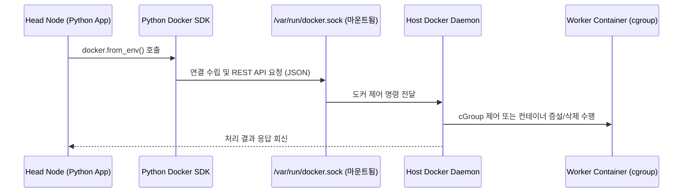

# Docker SDK 및 가상 클러스터 동적 제어 API 명세서 (API_SPECIFICATION)

본 문서는 Baby Ray 분산 시스템 환경에서 **Python Docker SDK**를 활용해 가상 워커 컨테이너들의 라이프사이클을 통제하고, cGroup 리소스를 동적으로 재설정하며, Auto Scaling을 수행하는 제어 API 명세서입니다. Docker SDK의 동작 원리와 코드 라인별 친절한 주석을 포함합니다.

---

## 1. Python Docker SDK의 동작 원리

Docker 컨테이너를 제어하는 모든 행위는 내부적으로 **Docker Daemon**에 REST API 요청을 보냄으로써 이루어집니다. 파이썬의 `docker` 라이브러리는 이 REST API를 추상화하여 편리한 객체지향 인터페이스를 제공하는 소프트웨어 개발 키트(SDK)입니다.

### 가. 호스트 소켓 연동 (`docker.sock`)
- Head Node 컨테이너가 호스트의 다른 컨테이너(Worker들)를 제어하기 위해, `docker-compose.yml`에서 호스트의 도커 데몬 소켓 파일인 `/var/run/docker.sock`을 컨테이너 내부의 동일 경로에 볼륨 마운트해 둡니다.
- SDK의 `docker.from_env()`를 호출하면, 라이브러리는 이 소켓 파일을 자동으로 탐색하여 호스트의 도커 데몬에 관리 명령을 전달할 수 있는 세션을 활성화합니다.



---

## 2. Docker SDK 기반 가상 클러스터 제어 API 구현

스케줄러와 연동되어 워커 컨테이너들을 통제하는 실제 파이썬 구현 코드와 상세 주석 설명입니다.

### 가. SDK 인스턴스 초기화
```python
import docker

try:
    # docker.from_env()는 컨테이너 내부 환경 변수 및 마운트된 docker.sock 소켓을 자동으로 감지하여
    # 호스트 Docker 데몬에 명령을 내릴 수 있는 기본 클라이언트 객체를 생성합니다.
    client = docker.from_env()
except Exception as e:
    print(f"[Docker SDK 에러] 도커 데몬 소켓 연결 실패. 환경 설정을 확인하십시오: {e}")
    client = None
```

---

### 나. 워커 상태 및 자원 메트릭 모니터링 (`get_worker_status`)
- **역할**: 대상 워커 컨테이너가 정상 구동(`running`) 중인지 상태를 검사하고, 실시간 CPU/Memory 메트릭을 수집하여 수치화합니다.

```python
def get_worker_status(container_name):
    """
    지정한 컨테이너 이름을 가진 워커의 현재 라이프사이클 상태와 리소스 통계를 수집합니다.
    """
    if client is None:
        return {"status": "SDK_UNAVAILABLE", "cpu_util": 0.0, "mem_util": 0.0}
        
    try:
        # client.containers.get()은 도커 데몬에서 실행 중이거나 정지된 특정 컨테이너 객체를 검색해 옵니다.
        # 존재하지 않는 컨테이너일 경우 NotFound 에러를 발생시킵니다.
        container = client.containers.get(container_name)
        
        # container.status는 'running', 'exited', 'created' 등 컨테이너의 핵심 수명 주기 상태를 반환합니다.
        state = container.status
        
        # stream=False 옵션을 주면 실시간 스트리밍 대신 호출 시점의 리소스 사용량 스냅샷을 JSON 객체로 즉시 반환받습니다.
        stats = container.stats(stream=False)
        
        # --- 실시간 CPU 사용률 계산 수식 ---
        # 도커 컨테이너의 CPU 사용률은 누적 CPU 시간과 호스트 시스템의 CPU 시간 격차를 대비해 산출합니다.
        cpu_stats = stats.get("cpu_stats", {})
        precpu_stats = stats.get("precpu_stats", {})
        
        cpu_delta = cpu_stats.get("cpu_usage", {}).get("total_usage", 0) - precpu_stats.get("cpu_usage", {}).get("total_usage", 0)
        system_delta = cpu_stats.get("system_cpu_usage", 0) - precpu_stats.get("system_cpu_usage", 0)
        
        number_cpus = cpu_stats.get("online_cpus", 1)
        
        cpu_utilization = 0.0
        if system_delta > 0 and cpu_delta > 0:
            # 전체 시스템 대비 컨테이너가 사용한 CPU 비중 백분율 환산 (멀티코어 반영)
            cpu_utilization = (cpu_delta / system_delta) * number_cpus * 100.0
            
        # --- 실시간 메모리 사용률 계산 수식 ---
        memory_stats = stats.get("memory_stats", {})
        mem_usage = memory_stats.get("usage", 0)
        mem_limit = memory_stats.get("limit", 1)
        
        mem_utilization = (mem_usage / mem_limit) * 100.0 if mem_limit > 0 else 0.0
        
        return {
            "status": state,
            "cpu_utilization": round(cpu_utilization, 2),
            "memory_utilization": round(mem_utilization, 2)
        }
        
    except docker.errors.NotFound:
        # 컨테이너가 도커 데몬상에 아예 존재하지 않는 경우의 예외 처리
        print(f"[Docker SDK] 경고: 컨테이너 '{container_name}'를 찾을 수 없습니다.")
        return {"status": "NOT_FOUND", "cpu_utilization": 0.0, "memory_utilization": 0.0}
    except Exception as e:
        # 통신 장애 등 기타 예외 처리
        print(f"[Docker SDK] 상태 조회 실패: {str(e)}")
        return {"status": "ERROR", "cpu_utilization": 0.0, "memory_utilization": 0.0}
```

---

### 다. 동적 cGroup 자원 격리 조정 API (`resize_container_resources`)
- **역할**: 컨테이너를 정지하거나 재시작하는 무거운 오버헤드 없이, 구동 중인 상태 그대로 cGroup CPU 상한치와 메모리 제한치를 실시간으로 강제 조절합니다.

```python
def resize_container_resources(container_name, cpu_cores, memory_bytes):
    """
    실행 중인 워커 컨테이너의 리눅스 cGroup 제한(CPU 코어 및 메모리 바이트)을 실시간으로 업데이트합니다.
    """
    if client is None:
        return False, "Docker SDK 클라이언트가 연결되지 않았습니다."
        
    try:
        # 대상 컨테이너 객체를 도커로부터 조회해 옵니다.
        container = client.containers.get(container_name)
        
        # 1. CPU 코어 개수를 도커가 인지할 수 있는 나노초(nano cpus) 단위로 환산합니다.
        # 예: 0.5 CPU 코어 = 500,000,000 나노초 할당
        nano_cpus = int(cpu_cores * 1_000_000_000)
        
        # 2. container.update() API는 실행 중인 컨테이너에 cGroup 설정을 즉각 반영하는 핵심 SDK 함수입니다.
        # - nano_cpus: 컨테이너에 제한할 CPU 점유 상한
        # - mem_limit: 컨테이너에 제한할 최대 메모리 바이트
        # - memswap_limit: 메모리 스왑 용량을 실제 메모리 한계와 일치시켜 가상 스왑 디스크의 오동작(OOM 우회)을 완벽 차단합니다.
        container.update(
            nano_cpus=nano_cpus,
            mem_limit=memory_bytes,
            memswap_limit=memory_bytes
        )
        print(f"[Docker SDK] 자원 조정 완료 -> {container_name} | CPU: {cpu_cores} Cores, Mem: {memory_bytes} Bytes")
        return True, "Success"
        
    except docker.errors.NotFound:
        return False, f"컨테이너 '{container_name}'를 찾을 수 없습니다."
    except Exception as e:
        print(f"[Docker SDK] cGroup 자원 업데이트 실패 -> {container_name}: {str(e)}")
        return False, str(e)
```

---

### 라. Auto Scaling 동적 증설 및 회수 API (`scale_out_worker` / `scale_in_specific_worker`)
- **역할**: Q-Learning 에이전트의 결정에 따라 자식 프로세스 명령어 호출 없이, Python Docker SDK 라이브러리를 직접 호출하여 컨테이너를 동적으로 가동(`containers.run`)하고 제거(`stop` & `remove`)합니다.

```python
```python
def scale_out_worker(node_type):
    """
    Docker SDK(containers.run)를 직접 호출하여 Spot-A 워커 노드를 동적으로 띄웁니다.
    - cGroup 격리 제한(cpus, memory limit)을 실시간으로 지정합니다.
    - 순차 인덱스 규칙(worker-2-1 ~ worker-2-30)을 탐색하여 컨테이너 이름을 자동 부여합니다.
    """
    # ... docker.types.DeviceRequest를 활용한 GPU 바인딩 및 컨테이너 run 구동 ...
    DOCKER_CLIENT.containers.run(
        image="babyray-worker-image:latest",
        name=container_name,
        command=cmd,
        detach=True,
        network=network_name,
        nano_cpus=node_spec["nano_cpus"],
        mem_limit=node_spec["mem_limit"],
        device_requests=device_requests,
        environment=env_variables
    )

def scale_in_specific_worker(node_type):
    """
    GCS에서 IDLE 상태인 스팟 워커 중 메모리 오버로드(90% 이상) 조짐이 있거나 유휴 중인 대상 컨테이너를 탐색합니다.
    - Docker SDK를 통해 container.stop(timeout=5) 및 container.remove()를 수행하여 호스트 자원을 완전 해제합니다.
    """
    container = DOCKER_CLIENT.containers.get(container_ref)
    container.stop(timeout=5)
    container.remove()
```

---

## 3. 리눅스 cGroup 파라미터 매핑 정보

Docker SDK가 제어하는 `nano_cpus` 및 `mem_limit` 파라미터는 리눅스 커널 내부의 실제 cGroup 시스템 파일들과 1:1로 정확하게 매핑되어 연동됩니다.

| Docker SDK 파라미터 | 실제 cGroup 시스템 파일 경로 | 설명 |
| :--- | :--- | :--- |
| **`nano_cpus`** | `/sys/fs/cgroup/cpu/cpu.cfs_quota_us`<br>`/sys/fs/cgroup/cpu/cpu.cfs_period_us` | `cfs_period_us` 주기(기본 100ms) 대비 컨테이너가 선점해 사용할 수 있는 최대 CPU 나노초 비율 할당 |
| **`mem_limit`** | `/sys/fs/cgroup/memory/memory.limit_in_bytes` | 컨테이너 내부 프로세스 그룹이 사용할 수 있는 물리 메모리의 최대 바이트 상한값 정의 (초과 시 OOM 발생) |
| **`memswap_limit`** | `/sys/fs/cgroup/memory/memory.memsw.limit_in_bytes` | 스왑 메모리 공간까지 포함한 총합 제한선 설정 |

---

## 4. Q-Learning 및 Head Node 연동 시나리오

스케줄러 루프 내에서 본 명세서의 Docker API가 호출되는 동작 시나리오와 흐름 제어 아키텍처입니다.

```
[태스크 대기열(Task Queue) 병목 감지 및 자원 부족]
                   │
                   ▼ (q_learning.py 의사결정)
[Action.SCALE_OUT 액션 도출]
                   │
                   ▼ (head.py 스케줄러 루프)
[scale_out_worker("spot_a") 호출]
                   │
                   ▼ (Docker SDK 라이브러리 직접 구동)
[DOCKER_CLIENT.containers.run() 실행]
                   │
                   ▼ (신규 Spot-A Worker 컨테이너 기동 - 순차 인덱스 부여)
[Worker 컨테이너 내 gRPC 통신 서버 초기 구동]
                   │
                   ▼ (worker.py의 heartbeat_sender 스레드)
[stub.RegisterWorker() 원격 호출 송신]
                   │
                   ▼ (head.py 가 수집 및 상태 등록 완료)
[신규 가용 노드 등록 완료 및 Task 큐 처리 재개]
```

---

## 5. 추가적인 Docker SDK 리소스 보호 및 관리 API

클러스터 기동 및 가속 연산 시 물리 호스트에 가해지는 과도한 컨테이너 오버헤드를 막고 안정성을 확보하기 위해, 다음과 같은 Docker SDK 제어 및 시스템 격리 방어 API들이 통합 구현되어 있습니다.

### ① 비동기 좀비 컨테이너 소거 API (`cleanup_zombie_containers`)
- **설계 의도**: GCS 오동작이나 비정상 셧다운으로 호스트 도커 엔진에 고아(Orphan) 상태로 무한 구동 중이던 구버전 스팟 컨테이너들을 정비하여 물리 메모리 누수를 완전히 차단합니다.
- **동작 방식**: 
  - `client.containers.list(all=True)` API를 호출해 `babyray-worker-` 프리픽스를 지닌 컨테이너를 탐색합니다.
  - 검출 즉시 백그라운드 스레드에서 비동기로 `container.remove(force=True)`를 연쇄 호출하여, gRPC 연결 초기 병목(3초 지연)을 전면 제거하고 부팅 즉시 정상 구동되도록 유도합니다.

### ② 호스트 가용 메모리 계측 가드 (`is_host_resource_sufficient`)
- **설계 의도**: Docker SDK의 `containers.run`을 다중 실행할 시, 호스트 실제 물리 메모리가 한계에 도달해 가상 머신(WSL2) 및 윈도우 OS 커널이 얼어붙는 현상을 방지합니다.
- **동작 방식**: 스케일아웃 실행 전 `psutil.virtual_memory().available` 가 가상 임계치인 **2.0 GB** 아래로 떨어질 경우 도커 컨테이너 기동을 강제 차단 및 예외 보류시킵니다.

### ③ GPU VRAM 감지 및 스케일아웃 제어 (`get_gpu_free_memory`)
- **설계 의도**: `torch.cuda.is_available()` 상태에서 여러 컨테이너에 GPU 패스스루를 지정할 때, 물리 VRAM(8GB)이 고갈되어 CUDA 드라이버 패닉이 유발되는 것을 선제 예방합니다.
- **동작 방식**: 스케일아웃 전에 가용 VRAM 용량이 **500 MiB 미만**인 지점을 스캔하여, 부족할 경우 컨테이너 생성 단계에서 기동을 세이프 홀딩합니다.

### ④ 포트 충돌 방지 및 ID 번호 재사용 (Index Recycling)
- **설계 의도**: 동적 노드 관리 시 포트 매핑 충돌이나 도커 컨테이너 이름 중복으로 인해 `containers.run` 호출 자체가 실패하는 도커 엔진 레벨의 예외를 사전 방지합니다.
- **동작 방식**: 
  - GCS 레지스트리의 포트를 전수 비교하여 `candidate_port += 1`로 포트 바인딩 중복을 회피합니다.
  - `existing_indices`를 계산하여 감축된 노드 번호 중 비어 있는 가장 작은 양의 정수를 찾아 컨테이너명(`babyray-worker-2-x`)으로 우선 선점 및 재사용합니다.

---

## 6. [고민할 지점] OS 자원 관리 이론과 도커 자원 오버커밋(Overcommit) 실증 분석

가상화 환경에서 자원을 효율적으로 관리하기 위해 OS의 전통적인 메모리 할당 이론을 도커 인프라에 투영했을 때 발생하는 설계적 모순과 고민할 지점들에 대한 분석입니다.

### 가. 물리적 점유(Physical Allocation)와 논리적 예약(Logical Reservation)의 괴리
* **현상**: 시스템 구동 시 워커 노드들에 rigid한 메모리 한도(Limits: 2GB)를 걸어두고 여러 태스크를 할당함에도 불구하고, 호스트 컴퓨터 수준에서 실제 OOM 장애가 발생하는 빈도가 극히 낮습니다.
* **원인 (cgroup의 작동 원리)**: 도커의 메모리 Limits 설정은 OS의 **고정 분할(Fixed Partitioning)**처럼 물리 메모리를 즉시 선점 및 격리하는 방식이 아닙니다. 프로세스가 실제로 메모리를 요구할 때만 호스트 RAM을 동적으로 할당하는 On-Demand 방식으로 동작합니다. 따라서 워커가 100MB의 가벼운 학습만 구동 중이라면 호스트 RAM도 100MB만 소모하여 남는 자원은 호스트가 공유합니다.
* **스케줄러 단편화**: 그러나 상용 오케스트레이터(Kubernetes 등)는 안정성을 위해 **선언값(Limits)의 총합**을 기준으로 빈자리를 계산하므로, 물리 자원이 넉넉해도 논리적 예약 락이 걸려 추가 컨테이너를 올리지 못하는 **논리적 내부 단편화(Internal Fragmentation)** 문제를 야기합니다.

### 나. 잉여 자원 동적 회수(Dynamic Reclaiming)와 미래 예측의 딜레마
* **고민 지점**: "만약 스케줄러가 논리적 락을 풀고, 워커 A가 사용하지 않는 잉여 메모리(예: 1.9GB)를 회수하여 워커 B에게 빌려준다면 어떨까?"
* **한계 (The Oracle Requirement)**: 스케줄러는 워커 A가 미래에 언제 대규모 연산(LSTM 등)을 시작해 메모리를 크게 점유할지(Spike) 알 수 없습니다. 미래 요구량을 모르는 상태에서 자원을 넘겨주었다가 동시에 메모리를 사용하게 되면 전체 물리 노드가 붕괴하는 OOM 충돌이 발생합니다.
* **해결 매커니즘 비교**:
  1. **OS 계층 (Swapping)**: 예측하지 않고 일단 빌려주되, 충돌 시 사용 빈도가 낮은 페이지를 디스크로 내보냅니다(Page Out). 하지만 이종 딥러닝 연산 환경에서는 디스크 I/O 병목(Thrashing)으로 속도가 극도로 저하되어 적합하지 않습니다.
  2. **클라우드 오케스트레이터 계층 (QoS & Eviction)**: 자원을 우선 오버커밋(Overcommit)하여 잉여분을 다른 컨테이너에게 빌려주되, 원래 주인이 자원을 요구하는 충돌(Spike) 순간에 **우선순위가 낮은 컨테이너를 강제 격하/종료(Evict/OOM Kill)시켜 물리 자원을 회수**합니다.

본 BabyRay 시스템은 이 컨테이너 레벨의 **우선순위 기반 강제 선점 및 회수(Eviction)** 흐름을 **Spot 노드의 자동 파괴 및 GCS Task Lineage 재적재 복구 메커니즘**으로 결합하여 클러스터 수준에서 완벽히 에뮬레이션해 냈습니다.


