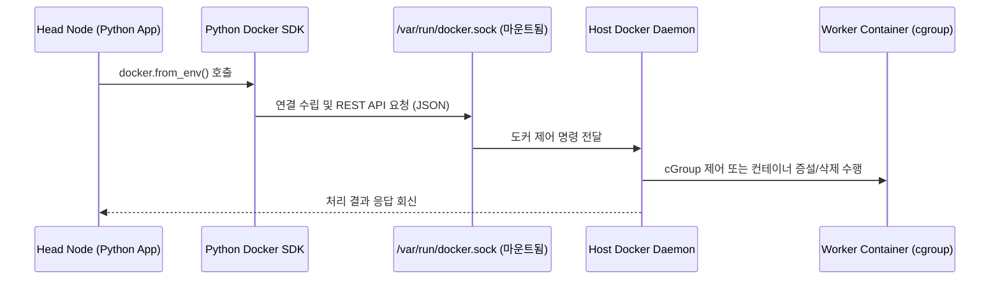

# Docker SDK 및 가상 클러스터 동적 제어 API 명세서 (API_SPECIFICATION)

본 문서는 Baby Ray 분산 시스템 환경에서 **Python Docker SDK**를 활용해 가상 워커 컨테이너들의 라이프사이클을 통제하고, cGroup 리소스를 동적으로 재설정하며, Auto Scaling을 수행하는 제어 API 명세서입니다. Docker SDK의 동작 원리와 코드 라인별 친절한 주석을 포함합니다.

---

## 1. Python Docker SDK의 동작 원리

Docker 컨테이너를 제어하는 모든 행위는 내부적으로 **Docker Daemon**에 REST API 요청을 보냄으로써 이루어집니다. 파이썬의 `docker` 라이브러리는 이 REST API를 추상화하여 편리한 객체지향 인터페이스를 제공하는 소프트웨어 개발 키트(SDK)입니다.

### 가. 호스트 소켓 연동 (`docker.sock`)
- Head Node 컨테이너가 호스트의 다른 컨테이너(Worker들)를 제어하기 위해, `docker-compose.yml`에서 호스트의 도커 데몬 소켓 파일인 `/var/run/docker.sock`을 컨테이너 내부의 동일 경로에 볼륨 마운트해 둡니다.
- SDK의 `docker.from_env()`를 호출하면, 라이브러리는 이 소켓 파일을 자동으로 탐색하여 호스트의 도커 데몬에 관리 명령을 전달할 수 있는 세션을 활성화합니다.



---

## 2. Docker SDK 기반 가상 클러스터 제어 API 구현

스케줄러와 연동되어 워커 컨테이너들을 통제하는 실제 파이썬 구현 코드와 상세 주석 설명입니다.

### 가. SDK 인스턴스 초기화
```python
import docker

try:
    # docker.from_env()는 컨테이너 내부 환경 변수 및 마운트된 docker.sock 소켓을 자동으로 감지하여
    # 호스트 Docker 데몬에 명령을 내릴 수 있는 기본 클라이언트 객체를 생성합니다.
    client = docker.from_env()
except Exception as e:
    print(f"[Docker SDK 에러] 도커 데몬 소켓 연결 실패. 환경 설정을 확인하십시오: {e}")
    client = None
```

---

### 나. 워커 상태 및 자원 메트릭 모니터링 (`get_worker_status`)
- **역할**: 대상 워커 컨테이너가 정상 구동(`running`) 중인지 상태를 검사하고, 실시간 CPU/Memory 메트릭을 수집하여 수치화합니다.

```python
def get_worker_status(container_name):
    """
    지정한 컨테이너 이름을 가진 워커의 현재 라이프사이클 상태와 리소스 통계를 수집합니다.
    """
    if client is None:
        return {"status": "SDK_UNAVAILABLE", "cpu_util": 0.0, "mem_util": 0.0}
        
    try:
        # client.containers.get()은 도커 데몬에서 실행 중이거나 정지된 특정 컨테이너 객체를 검색해 옵니다.
        # 존재하지 않는 컨테이너일 경우 NotFound 에러를 발생시킵니다.
        container = client.containers.get(container_name)
        
        # container.status는 'running', 'exited', 'created' 등 컨테이너의 핵심 수명 주기 상태를 반환합니다.
        state = container.status
        
        # stream=False 옵션을 주면 실시간 스트리밍 대신 호출 시점의 리소스 사용량 스냅샷을 JSON 객체로 즉시 반환받습니다.
        stats = container.stats(stream=False)
        
        # --- 실시간 CPU 사용률 계산 수식 ---
        # 도커 컨테이너의 CPU 사용률은 누적 CPU 시간과 호스트 시스템의 CPU 시간 격차를 대비해 산출합니다.
        cpu_stats = stats.get("cpu_stats", {})
        precpu_stats = stats.get("precpu_stats", {})
        
        cpu_delta = cpu_stats.get("cpu_usage", {}).get("total_usage", 0) - precpu_stats.get("cpu_usage", {}).get("total_usage", 0)
        system_delta = cpu_stats.get("system_cpu_usage", 0) - precpu_stats.get("system_cpu_usage", 0)
        
        number_cpus = cpu_stats.get("online_cpus", 1)
        
        cpu_utilization = 0.0
        if system_delta > 0 and cpu_delta > 0:
            # 전체 시스템 대비 컨테이너가 사용한 CPU 비중 백분율 환산 (멀티코어 반영)
            cpu_utilization = (cpu_delta / system_delta) * number_cpus * 100.0
            
        # --- 실시간 메모리 사용률 계산 수식 ---
        memory_stats = stats.get("memory_stats", {})
        mem_usage = memory_stats.get("usage", 0)
        mem_limit = memory_stats.get("limit", 1)
        
        mem_utilization = (mem_usage / mem_limit) * 100.0 if mem_limit > 0 else 0.0
        
        return {
            "status": state,
            "cpu_utilization": round(cpu_utilization, 2),
            "memory_utilization": round(mem_utilization, 2)
        }
        
    except docker.errors.NotFound:
        # 컨테이너가 도커 데몬상에 아예 존재하지 않는 경우의 예외 처리
        print(f"[Docker SDK] 경고: 컨테이너 '{container_name}'를 찾을 수 없습니다.")
        return {"status": "NOT_FOUND", "cpu_utilization": 0.0, "memory_utilization": 0.0}
    except Exception as e:
        # 통신 장애 등 기타 예외 처리
        print(f"[Docker SDK] 상태 조회 실패: {str(e)}")
        return {"status": "ERROR", "cpu_utilization": 0.0, "memory_utilization": 0.0}
```

---

### 다. 동적 cGroup 자원 격리 조정 API (`resize_container_resources`)
- **역할**: 컨테이너를 정지하거나 재시작하는 무거운 오버헤드 없이, 구동 중인 상태 그대로 cGroup CPU 상한치와 메모리 제한치를 실시간으로 강제 조절합니다.

```python
def resize_container_resources(container_name, cpu_cores, memory_bytes):
    """
    실행 중인 워커 컨테이너의 리눅스 cGroup 제한(CPU 코어 및 메모리 바이트)을 실시간으로 업데이트합니다.
    """
    if client is None:
        return False, "Docker SDK 클라이언트가 연결되지 않았습니다."
        
    try:
        # 대상 컨테이너 객체를 도커로부터 조회해 옵니다.
        container = client.containers.get(container_name)
        
        # 1. CPU 코어 개수를 도커가 인지할 수 있는 나노초(nano cpus) 단위로 환산합니다.
        # 예: 0.5 CPU 코어 = 500,000,000 나노초 할당
        nano_cpus = int(cpu_cores * 1_000_000_000)
        
        # 2. container.update() API는 실행 중인 컨테이너에 cGroup 설정을 즉각 반영하는 핵심 SDK 함수입니다.
        # - nano_cpus: 컨테이너에 제한할 CPU 점유 상한
        # - mem_limit: 컨테이너에 제한할 최대 메모리 바이트
        # - memswap_limit: 메모리 스왑 용량을 실제 메모리 한계와 일치시켜 가상 스왑 디스크의 오동작(OOM 우회)을 완벽 차단합니다.
        container.update(
            nano_cpus=nano_cpus,
            mem_limit=memory_bytes,
            memswap_limit=memory_bytes
        )
        print(f"[Docker SDK] 자원 조정 완료 -> {container_name} | CPU: {cpu_cores} Cores, Mem: {memory_bytes} Bytes")
        return True, "Success"
        
    except docker.errors.NotFound:
        return False, f"컨테이너 '{container_name}'를 찾을 수 없습니다."
    except Exception as e:
        print(f"[Docker SDK] cGroup 자원 업데이트 실패 -> {container_name}: {str(e)}")
        return False, str(e)
```

---

### 라. Auto Scaling 동적 증설 및 회수 API (`scale_workers`)
- **역할**: Q-Learning 에이전트가 `Action.SCALE_OUT` 결정을 내리거나, 로드밸런싱 필요 시 Docker Compose 명령어를 자식 프로세스로 호출하여 노드 개수를 스케일 인/아웃(Scale-in/out) 제어합니다.

```python
import subprocess

def scale_workers(service_name, target_count):
    """
    docker-compose CLI 명령어를 실행하여 해당 워커 서비스 컨테이너 인스턴스를 지정된 개수로 증설하거나 축소합니다.
    """
    try:
        # CLI 명령 구문을 파이썬의 리스트 포맷으로 정의합니다.
        # -f 옵션으로 docker-compose.yml의 상대 위치를 지정해 줍니다.
        # --scale 옵션을 통해 (예: worker-2=3) 해당 서비스의 컨테이너 활성 개수를 통제합니다.
        cmd = [
            "docker", "compose", 
            "-f", "docker/docker-compose.yml", 
            "up", "-d", 
            "--scale", f"{service_name}={target_count}"
        ]
        
        # subprocess.run()을 사용하여 서브 프로세스 쉘에서 도커 컴포즈 CLI 명령어를 구동시킵니다.
        # - capture_output=True: 명령어 실행 결과(stdout, stderr)를 파이썬 변수로 받아옵니다.
        # - check=True: 명령어 오류 코드 반환 시 CalledProcessError 예외를 강제 발생시켜 안전한 예외 제어를 돕습니다.
        result = subprocess.run(cmd, capture_output=True, text=True, check=True)
        print(f"[Docker SDK CLI] 스케일링 명령 수행 성공 -> {service_name} 를 {target_count}대로 갱신.")
        return True
        
    except subprocess.CalledProcessError as e:
        print(f"[Docker SDK CLI] 스케일링 수행 에러: {e.stderr}")
        return False
```

---

## 3. 리눅스 cGroup 파라미터 매핑 정보

Docker SDK가 제어하는 `nano_cpus` 및 `mem_limit` 파라미터는 리눅스 커널 내부의 실제 cGroup 시스템 파일들과 1:1로 정확하게 매핑되어 연동됩니다.

| Docker SDK 파라미터 | 실제 cGroup 시스템 파일 경로 | 설명 |
| :--- | :--- | :--- |
| **`nano_cpus`** | `/sys/fs/cgroup/cpu/cpu.cfs_quota_us`<br>`/sys/fs/cgroup/cpu/cpu.cfs_period_us` | `cfs_period_us` 주기(기본 100ms) 대비 컨테이너가 선점해 사용할 수 있는 최대 CPU 나노초 비율 할당 |
| **`mem_limit`** | `/sys/fs/cgroup/memory/memory.limit_in_bytes` | 컨테이너 내부 프로세스 그룹이 사용할 수 있는 물리 메모리의 최대 바이트 상한값 정의 (초과 시 OOM 발생) |
| **`memswap_limit`** | `/sys/fs/cgroup/memory/memory.memsw.limit_in_bytes` | 스왑 메모리 공간까지 포함한 총합 제한선 설정 |

---

## 4. Q-Learning 및 Head Node 연동 시나리오

스케줄러 루프 내에서 본 명세서의 Docker API가 호출되는 동작 시나리오와 흐름 제어 아키텍처입니다.

```
[태스크 대기열(Task Queue) 폭증 감지 (5개 초과 지속)]
                   │
                   ▼ (q_learning.py 의사결정)
[Action.SCALE_OUT 액션 도출]
                   │
                   ▼ (head.py 스케줄러 루프)
[scale_workers("worker-2", target_count) 호출]
                   │
                   ▼ (Docker SDK CLI 명령어 구동)
[docker compose up -d --scale worker-2=N]
                   │
                   ▼ (신규 Spot Worker 컨테이너 기동)
[Worker 컨테이너 내 gRPC 통신 서버 초기 구동]
                   │
                   ▼ (worker.py의 heartbeat_sender 스레드)
[stub.RegisterWorker() 원격 호출 송신]
                   │
                   ▼ (head.py 가 수집 및 상태 등록 완료)
[신규 가용 노드 등록 완료 및 Task 큐 처리 재개]
```
