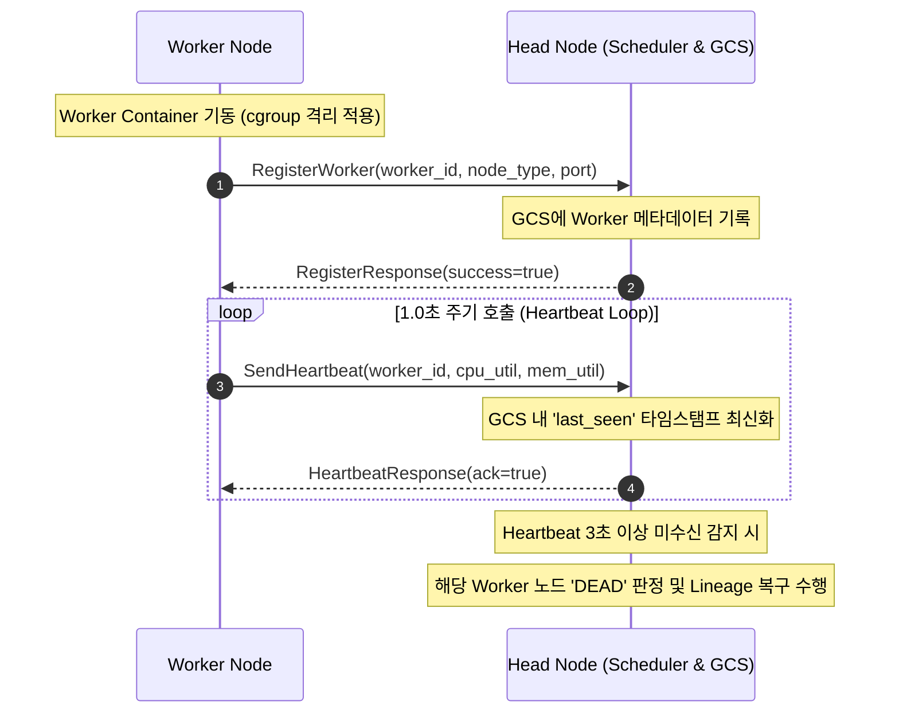
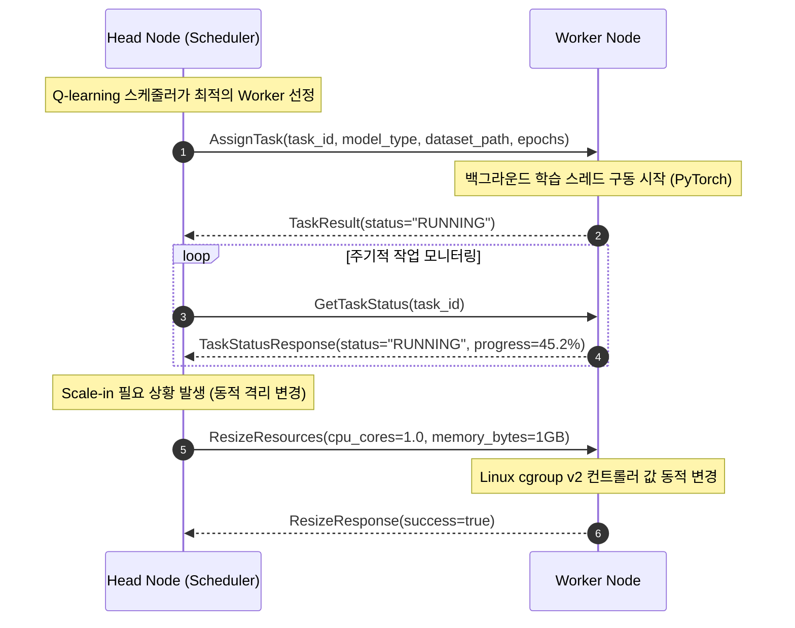

# Baby Ray: gRPC API 및 메커니즘 상세 기술 설계서

본 문서는 Docker 기반 경량 분산 런타임(Baby Ray)에서 Head Node와 Worker Nodes 간의 고속 제어와 상태 공유를 담당하는 **gRPC 통신 기술 명세서**입니다. gRPC의 아키텍처적 장점과 핵심 메커니즘, 그리고 본 프로젝트에서의 API 매핑 구조와 데이터 흐름을 상세하게 기술합니다.

---

## 1. gRPC 정의 및 핵심 동작 아키텍처

gRPC(Google Remote Procedure Call)는 구글이 개발한 오픈소스 고성능 원격 프로시저 호출 프레임워크입니다. 네트워크를 통해 다른 컴퓨터에 위치한 함수를 마치 로컬 함수처럼 직접 호출할 수 있도록 설계되었습니다.

### 가. HTTP/2 기반 전송 프로토콜의 이점
기존 HTTP/1.1 기반의 REST API는 연결 재사용이 불가능하거나 제한적이며, 무겁고 반복적인 텍스트 기반 헤더(Header) 전송 및 HTTP HoL(Head-of-Line) Blocking으로 인해 높은 네트워크 지연을 초래합니다. gRPC는 **HTTP/2**를 채택하여 이를 완벽하게 해결합니다.

1. **멀티플렉싱 (Multiplexing)**: 단일 TCP 커넥션 위에서 여러 gRPC 요청과 응답 스트림이 동시에 인터리빙(Interleaving)되어 병렬 송수신됩니다. 이로 인해 연결 생성 오버헤드가 제거되고 동시 처리 성능이 크게 향상됩니다.
2. **이진 프레이밍 (Binary Framing)**: 텍스트 대신 이진(Binary) 포맷으로 데이터를 분할 및 전송하여 파싱 속도가 빠르고 데이터 전송량이 줄어듭니다.
3. **헤더 압축 (HPACK)**: 중복된 HTTP 헤더 정보를 압축 알고리즘(HPACK)을 통해 축소시켜 불필요한 네트워크 대역폭 낭비를 방지합니다.
4. **양방향 통신 (Bidirectional Streaming)**: 클라이언트와 서버가 커넥션을 양방향으로 동시 활용해 실시간 이벤트와 메트릭 데이터를 제어 흐름 지연 없이 송수신할 수 있습니다.

### 나. Protocol Buffers (Protobuf) 기반 직렬화
gRPC는 인터페이스 정의 언어(IDL) 및 직렬화 포맷으로 **Protocol Buffers v3**를 사용합니다.
* **높은 성능**: JSON이나 XML과 같은 텍스트 포맷과 달리 데이터를 이진 코드로 밀도 높게 직렬화하므로 직렬화/역직렬화 속도가 최대 수십 배 빠르며 가벼운 패킷 크기를 가집니다.
* **타입 안전성 (Type Safety)**: `.proto` 스키마 파일을 기준으로 양 노드 간의 데이터 필드 이름, 타입, 번호가 엄격히 바인딩되므로 런타임 통신 정합성이 극대화됩니다.

---

## 2. gRPC의 4가지 주요 통신 메커니즘

gRPC는 API 요구사항에 맞춰 4가지 형태의 유연한 스트리밍 및 응답 구조를 지원합니다.

```
1. Unary (단방향 RPC)               2. Server Streaming (서버 스트리밍)
   Client  ---> [ Request ] ---> Server   Client  ---> [ Request ] ---> Server
   Client  <--- [ Response ] <--- Server   Client  <--- [ Stream.. ] <--- Server

3. Client Streaming (클라이언트 스트리밍)  4. Bidirectional Streaming (양방향 스트리밍)
   Client  ---> [ Stream.. ] ---> Server   Client  <---> [ Stream.. ] <---> Server
   Client  <--- [ Response ] <--- Server
```

1. **Unary RPCs (단방향 RPC)**
   * 클라이언트가 단일 요청을 전송하고 서버가 단일 응답을 반환하는 전통적인 요청-응답 모델입니다.
   * *예시: 회원 정보 조회, 리소스 할당 명령 등*
2. **Server Streaming RPCs**
   * 클라이언트가 단일 요청을 보내면, 서버는 다수의 응답 메시지 스트림을 보내 작업을 완료합니다. 클라이언트는 모든 응답 스트림이 끝날 때까지 대기하며 순차 처리합니다.
   * *예시: 대용량 머신러닝 로그 실시간 추적, 이미지 파일 분할 스트리밍 등*
3. **Client Streaming RPCs**
   * 클라이언트가 다수의 요청 메시지 스트림을 연속적으로 전송하고, 서버는 메시지를 모두 수신한 후 단일 응답을 반환합니다.
   * *예시: 센서 데이터 대량 업로드, 청크 단위 모델 파일 업로드 등*
4. **Bidirectional Streaming RPCs (양방향 스트리밍)**
   * 클라이언트와 서버가 각각 독립적인 메시지 스트림을 동시에 송수신합니다. 양측의 읽기/쓰기 시점은 완전히 자율적입니다.
   * *예시: 실시간 실물자산 가치 반영 채팅, 양방향 제어 오케스트레이션 등*

---

## 3. Baby Ray 분산 시스템에서의 gRPC API 메커니즘 설계

Baby Ray 프로젝트는 통신의 독립성과 유연한 장애 복구를 고려하여 API를 설계했습니다.

### 가. API 매핑 정의 및 아키텍처적 합의

| RPC 메서드명 | 송수신 방향 | gRPC 통신 메커니즘 | 기술적 설계 배경 및 결정 근거 |
| :--- | :--- | :--- | :--- |
| **RegisterWorker** | Worker $\rightarrow$ Head | **Unary** | 새로운 Worker 컨테이너가 구동될 때 Head의 GCS(Global Control Store) 인메모리 풀에 노드 상태를 즉시 등록하고, 포트 바인딩 및 등록 성공 여부(`success: true/false`)를 동기식으로 응답 받습니다. |
| **DeregisterWorker** | Worker $\rightarrow$ Head | **Unary** | 스케줄러의 축소(Scale-in) 지시를 받은 Worker가 종료 직전 자신의 상태를 깔끔하게 해제하기 위해 호출하며, 정상 해제 시 커넥션을 닫습니다. |
| **SendHeartbeat** | Worker $\rightarrow$ Head | **Unary (주기적 호출)** | **[결정 근거]** 양방향 스트리밍 대신 **1초 주기 Unary 호출**을 채택했습니다. 이는 가상 노드 장애로 인해 프로세스가 강제 정지(`docker stop`)되거나 네트워크가 유실될 때, 스트림 끊김 감지 이전에 Head 측 스레드가 블록되지 않고 타이머 기반 만료 시간(3초)을 독립적으로 평가하여 결함 탐지의 강인함(Robustness)을 보장하기 위함입니다. |
| **AssignTask** | Head $\rightarrow$ Worker | **Unary** | 스케줄러가 특정 워커에게 ML 모델 학습 연산(SimpleCNN/RNN/LSTM) 명령을 푸시합니다. 워커는 수신 즉시 로컬 연산 백그라운드 스레드를 기동하고 수락 응답을 보냅니다. |
| **GetTaskStatus** | Head $\rightarrow$ Worker | **Unary (Polling)** | **[향후 심화 설계]** 현재는 간단한 Unary Polling 구조로 상태를 조회합니다. 향후 학습 속도가 긴 작업에 대해서는 학습률(progress)과 에포크별 Loss 로그를 실시간으로 받아보기 위해 **Server Streaming RPC**로 확장하여 오버헤드를 감소시킬 수 있는 구조를 고려해 두었습니다. |
| **ResizeResources** | Head $\rightarrow$ Worker | **Unary** | 동적 자원 리사이징(Scale-in 조율 및 자원 조절)을 지시하고 변경 성공 여부를 반환받습니다. |

### 나. 시스템 상호작용 시퀀스 다이어그램 (Sequence Diagram)

#### 1. Worker 등록 및 주기적 Heartbeat 생존 신고


#### 2. 작업 배정, 모니터링 및 자원 조절


---

## 4. Protobuf API 명세 및 데이터 필드 명세

### 가. `BabyRayService` 서비스 인터페이스 정의
```protobuf
service BabyRayService {
  rpc RegisterWorker (RegisterRequest) returns (RegisterResponse);
  rpc DeregisterWorker (DeregisterRequest) returns (DeregisterResponse);
  rpc SendHeartbeat (HeartbeatRequest) returns (HeartbeatResponse);
  rpc AssignTask (TaskAssignment) returns (TaskResult);
  rpc GetTaskStatus (TaskStatusRequest) returns (TaskStatusResponse);
  rpc ResizeResources (ResizeRequest) returns (ResizeResponse);
}
```

### 나. 메시지 및 데이터 필드 상세 규격

#### 1. Worker 등록/제거 메시지
* **RegisterRequest**
  * `string worker_id` (tag 1): Worker 노드의 고유 식별자 (예: `dynamic-worker-1`).
  * `string node_type` (tag 2): 노드 요금 및 자원 성격 구분 (`on_demand`, `spot_a`, `spot_b`).
  * `int32 port` (tag 3): Worker 내부 gRPC 서버 포트 번호.
* **RegisterResponse**
  * `bool success` (tag 1): 등록 성공 여부.
  * `string message` (tag 2): 에러 상세 또는 성공 메시지.
* **DeregisterRequest / DeregisterResponse**
  * Worker가 해제될 때 송수신하는 식별자 및 결과 상태 메시지.

#### 2. 생존 신고 메시지 (Heartbeat)
* **HeartbeatRequest**
  * `string worker_id` (tag 1): 생존 신고를 보내는 워커 식별자.
  * `float cpu_utilization` (tag 2): 현재 Worker 컨테이너 내부의 실시간 CPU 사용률 (0.0 ~ 100.0%).
  * `float memory_utilization` (tag 3): 현재 Worker 컨테이너 내부의 실시간 Memory 사용률 (0.0 ~ 100.0%).
* **HeartbeatResponse**
  * `bool ack` (tag 1): Head Node 수신 확인 신호.

#### 3. 태스크 제어 및 모니터링 메시지
* **TaskAssignment**
  * `string task_id` (tag 1): 수행할 Task의 고유 ID.
  * `string model_type` (tag 2): 학습할 AI 모델 분류 (`CNN`, `RNN`, `LSTM`).
  * `string dataset_path` (tag 3): 학습 시 참조할 가상 데이터셋 경로.
  * `int32 epochs` (tag 4): 총 학습 수행 횟수.
* **TaskResult**
  * `string task_id` (tag 1): 타겟 Task의 ID.
  * `string status` (tag 2): 초기 배정 결과 상태 (`RUNNING`, `FAILED`).
  * `float execution_time` (tag 3): 완료 시의 누적 연산 소요 시간.
* **TaskStatusRequest / TaskStatusResponse**
  * `string status` (tag 1): 현재 상태 (`RUNNING`, `COMPLETED`, `FAILED`).
  * `float progress` (tag 2): 현재 완료된 Epoch 비율 백분율 (0.0 ~ 100.0%).
  * `string logs` (tag 3): 실시간 로그 또는 오류 스택.

#### 4. 동적 자원 변경 메시지 (cgroup 조절용)
* **ResizeRequest**
  * `float cpu_cores` (tag 1): 변경할 CPU 코어 수 (예: `1.5` -> 1.5 Cores 제한).
  * `int64 memory_bytes` (tag 2): 변경할 메모리 크기 바이트 단위 (예: `1073741824` -> 1GB 제한).
* **ResizeResponse**
  * `bool success` (tag 1): 자원 격리 한계치 수정 성공 여부.
  * `string message` (tag 2): 시스템 반영 상세 메시지.
