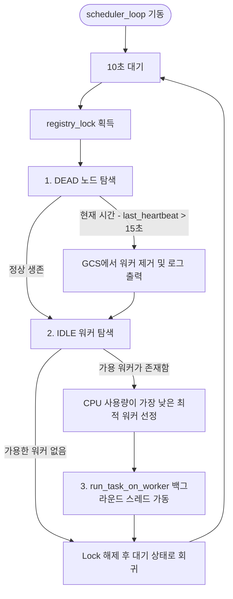

# Head Node 기술 명세서: 분산 제어, GCS 레지스트리 및 스케줄러

이 문서는 Baby Ray 분산 컴퓨팅 시스템의 중앙 통제 역할을 수행하는 **Head Node**의 아키텍처, 데이터 구조, gRPC 서버 명세 및 스케줄링 메커니즘을 정의한 기술 명세서입니다.

---

## 1. 개요 및 역할

Head Node는 클러스터의 마스터 노드로서 분산 시스템 내 모든 메타데이터를 유지 및 동기화하는 **GCS(Global Control Store)** 역할을 겸하며, 워커들의 생존 상태를 감시하고 최적의 워커 노드에 연산 작업을 분배하는 지능형 스케줄러를 가동합니다.

```
                  ┌──────────────────────────────────────────┐
                  │                 Head Node                │
                  │  ┌──────────────┐      ┌──────────────┐  │
                  │  │   gRPC 서버   │      │  스케줄러    │  │
                  │  │ (Heartbeat,  │ <──> │  및 모니터링 │  │
                  │  │  Register)   │      │   루프       │  │
                  │  └──────────────┘      └──────────────┘  │
                  │          ▲                     │         │
                  │          │ (인메모리 갱신)      │ (Assign)│
                  │          ▼                     ▼         │
                  │  ┌──────────────────────────────────┐    │
                  │  │   worker_registry (인메모리 GCS)   │    │
                  │  └──────────────────────────────────┘    │
                  └──────────────────────────────────────────┘
                               ▲                   │
                    Heartbeat  │                   │ AssignTask
                    (매 1.0초) │                   │ (gRPC)
                               │                   ▼
                     [ Worker Containers (cgroup 격리) ]
```

---

## 2. 주요 데이터 구조

Head Node의 메모리 내에서 가상 분산 노드의 모든 메타데이터를 보존하고 다중 스레드 안전성을 확보하기 위해 다음 변수들을 활용합니다.

| 변수명 | 데이터 타입 | 설명 |
| :--- | :--- | :--- |
| `worker_registry` | `dict` | 등록된 모든 활성 워커의 상태 정보를 관리하는 인메모리 GCS. key는 `worker_id` (str)입니다. |
| `registry_lock` | `threading.Lock` | gRPC 요청 처리 스레드들과 스케줄러 백그라운드 스레드 간의 `worker_registry` 동시 접근(Race Condition)을 방지하기 위한 뮤텍스 락. |
| `task_counter` | `int` | 고유한 태스크 ID 생성을 위한 전역 카운터 변수. |

### `worker_registry` 내부 구조 예시
```json
{
  "worker-01": {
    "node_type": "on_demand",
    "ip": "172.18.0.2",
    "port": 50052,
    "last_heartbeat": 1719323456.78,
    "cpu": 12.5,
    "mem": 40.0,
    "status": "IDLE"
  }
}
```

---

## 3. gRPC 서비스 API 명세

Head Node는 워커 노드들의 등록, 퇴장 및 생존 신고(하트비트)를 처리하기 위해 `BabyRayServiceServicer`를 상속받은 gRPC 서버를 포트 `50051`에서 가동합니다.

### ① `RegisterWorker` (RPC)
- **역할**: 구동된 Worker Node의 최초 등록을 처리하고 GCS 레지스트리에 초기 세팅을 반영합니다.
- **요청 메시지 (`RegisterRequest`)**:
  - `worker_id` (str): 워커 식별자
  - `node_type` (str): 노드 등급 (`on_demand`, `spot_a`, `spot_b`)
  - `port` (int32): 워커가 수신 대기 중인 gRPC 포트 번호
- **응답 메시지 (`RegisterResponse`)**:
  - `success` (bool): 등록 성공 여부 (`True`/`False`)
  - `message` (str): 완료 혹은 에러 메시지
- **상세 동작**:
  - `context.peer()`를 파싱하여 호출한 워커의 실제 IP 주소(IPv4 또는 IPv6)를 동적으로 추출합니다. (WSL2 및 Docker 가상 네트워크 환경 대응)
  - `registry_lock`을 획득한 후 해당 워커 정보를 `status="IDLE"`, `cpu=0.0`, `mem=0.0`으로 초기화하여 `worker_registry`에 적재합니다.

### ② `DeregisterWorker` (RPC)
- **역할**: 워커가 프로세스 종료 시 보내는 퇴장 요청을 처리하여 클러스터 활성 노드 풀에서 즉시 제거합니다.
- **요청 메시지 (`DeregisterRequest`)**: `worker_id` (str)
- **응답 메시지 (`DeregisterResponse`)**: `success` (bool), `message` (str)

### ③ `SendHeartbeat` (RPC)
- **역할**: 각 워커로부터 실시간으로 전송되는 성능 및 자원 메트릭을 수신하여 갱신합니다.
- **요청 메시지 (`HeartbeatRequest`)**:
  - `worker_id` (str): 워커 식별자
  - `cpu_utilization` (float): 현재 워커 컨테이너의 실시간 CPU 사용률 (%)
  - `memory_utilization` (float): 현재 워커 컨테이너의 실시간 메모리 사용률 (%)
- **응답 메시지 (`HeartbeatResponse`)**: `ack` (bool)
- **상세 동작**:
  - `worker_registry`에서 해당 워커의 `last_heartbeat` 타임스탬프를 호출 시점의 `time.time()`으로 갱신합니다.
  - 전송받은 `cpu` 및 `mem` 사용률 수치를 레지스트리에 업데이트하여 스케줄러가 참조할 수 있게 합니다.

---

## 4. 백그라운드 스케줄러 및 모니터링 메커니즘

Head Node 구동 시, 메인 스레드와 별개로 두 가지 핵심 흐름(장애 감지 및 작업 스케줄링)을 가진 `scheduler_loop`가 백그라운드 스레드로 상시 실행됩니다.



### ① 장애 감지 및 자원 정리 루프
- **판정 기준**: 현재 시간(`time.time()`)에서 워커가 마지막으로 보낸 하트비트 시각(`last_heartbeat`)을 뺀 값이 **15.0초**를 초과하는 경우 해당 노드를 `DEAD` 상태로 판정합니다.
- **사후 처리**: `worker_registry`에서 해당 워커 정보를 완전 격리 삭제하고 경고 로그를 출력합니다. 이후 스케줄러는 해당 노드에 작업을 배정하지 않습니다.

### ② 자원 인지형 동적 스케줄링 (Resource-Aware Scheduling)
- **가용 풀 탐색**: `worker_registry` 내부의 워커 상태 변수인 `status`가 `"IDLE"`인 워커 노드들만 필터링합니다.
- **최적 노드 선정**: 필터링된 가용 워커 풀 중 **실시간 CPU 사용률(`cpu`)이 가장 낮은 워커**를 탐색하여 작업을 배정하도록 결정합니다.
  - 예시: `Worker-1` (CPU 12.5%, IDLE) / `Worker-2` (CPU 5.2%, IDLE) 일 경우 `Worker-2`가 최종 선정됩니다.
- **비동기 작업 실행**: 스케줄러의 루프가 블로킹되는 것을 방지하기 위해, 선정된 노드에 대한 작업 전송 및 완료 대기는 별도의 스레드(`run_task_on_worker`)를 통해 비동기 처리됩니다.

### ③ 실시간 진행 모니터링 (`run_task_on_worker`)
작업이 배정된 워커의 수명 주기 및 진행률을 실시간으로 추적하는 독립 실행 스레드입니다.
1. **상태 변경**: 대상 워커의 GCS 상태를 `"BUSY"`로 즉시 변경하여 추가적인 중복 할당을 방지합니다.
2. **AssignTask 요청**: 해당 워커의 gRPC 엔드포인트로 `AssignTask` 원격 호출을 보내어 모델 종류와 총 에포크 수를 지시합니다.
3. **상태 폴링 (Polling)**: 
   - 2초 간격으로 `stub.GetTaskStatus(...)`를 원격 호출하여 워커의 현재 진행률(`progress`)과 학습 로그(`logs`)를 실시간으로 받아옵니다.
   - 응답받은 상태 코드가 `SUCCESS`, `FAILED`, `COMPLETED` 중 하나에 해당하면 모니터링 루프를 해제합니다.
4. **자원 반환**: 태스크 처리가 완료되거나 예외 상황(gRPC 연결 끊김 등)이 발생하면 워커 노드의 상태를 다시 `"IDLE"`로 변경하여 다음 작업을 대기시킵니다.
