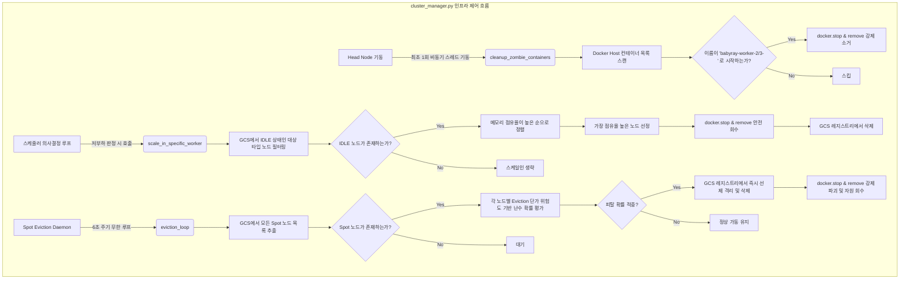

# Head Node 기술 명세서: 분산 제어, GCS 레지스트리 및 패키지 아키텍처

이 문서는 Baby Ray 분산 시스템의 통제 역할을 수행하는 **Head Node**의 리팩토링된 디렉토리 구조, 모듈 간 상호작용 및 gRPC API 규격을 정의한 기술 명세서입니다.

---

## 1. 개요 및 모듈 패키지 구조

Head Node는 클러스터의 마스터 노드로서 전역 공유 메타데이터를 유지하는 GCS와 리소스 감시 가드, 그리고 각 스케줄링 위임 모듈들로 세분화되어 관리됩니다.

```
head/
  ├── head.py              # [인프라] gRPC 서버 부팅 및 백그라운드 스케줄러 스레드 개시
  ├── state.py             # [인프라] worker_registry 및 task_status 전역 데이터 정의
  ├── cluster_manager.py   # [인프라] Docker SDK 컨테이너 조작 및 WSL2 가용 RAM 가드
  ├── scheduler/           # 기본 스케줄러 계층 패키지
  │     ├── __init__.py
  │     ├── core.py        # 중앙 제어 스레드 루프 (Backfilling 스케줄링 정책 실행)
  │     ├── static.py      # Static 스케줄러 스텝 함수
  │     └── dynamic.py     # Dynamic 스케줄러 스텝 함수
  └── q_learning/          # 지능형 Q-Learning 최적화 의사결정 패키지
        ├── __init__.py
        ├── agent.py       # QLearningAgent 클래스 (Aging 누적 지연 페널티 적용)
        ├── scheduler.py   # Q-Learning 스케줄러 스텝 의사결정 함수
        └── q_table.json   # 강화학습 경험치 테이블 JSON 영속 파일
```

---

## 2. 모듈간 데이터 흐름 및 상호작용

```
[ head.py (gRPC) ] ──(하트비트 수신)──> [ state.py (GCS 캐시) ]
        │                                       ▲
        └──────(스레드 실행 개시)───────────┐      │ (인메모리 자원 참조)
                                            ▼      │
                                    [ scheduler/core.py ] 
                                            │
                             ┌──────────────┼──────────────┐
                             ▼              ▼              ▼
                        [ static.py ]  [ dynamic.py ]  [ q_learning/scheduler.py ]
                                                           └──> [ agent.py ]
```

1.  **gRPC 인프라 (`head.py`)**: 워커 노드들의 생존 신고를 받아 `state.py`의 `worker_registry`에 하트비트 시각과 CPU/MEM을 실시간 업데이트합니다.
2.  **중앙 스케줄러 (`scheduler/core.py`)**: 백그라운드 스레드로 돌며 대기열에 작업이 유입되면 현재 활성화된 스케줄러 모드(`SCHEDULER_MODE = "dynamic"`)에 맞춰 해당 패키지 파일의 step 함수로 의사결정을 위임합니다.
3.  **지능형 의사결정 (`q_learning/`)**: Q-Learning 모드 기동 시, `agent.py`가 4차원 상태(태스크 프로파일, 활성 인스턴스 정보, 예산 잔량)를 평가하고 Bellman Equation에 맞춰 Q-Table을 갱신합니다.

---

## 3. 핵심 gRPC 서비스 API 명세

Head Node는 포트 `50051`에서 `BabyRayServiceServicer`를 가동하여 다음 RPC 통신을 수신 처리합니다.

### ① `RegisterWorker(RegisterRequest) -> RegisterResponse`
*   **역할**: 최초 기동된 워커 노드를 GCS 레지스트리에 `status="IDLE"`로 등록합니다.
*   **상세**: `context.peer()`를 역산하여 도커 가상 네트워크 브릿지 내의 워커 실제 IP 주소를 동적으로 감지하여 세팅합니다.

### ② `SendHeartbeat(HeartbeatRequest) -> HeartbeatResponse`
*   **역할**: 워커로부터 실시간 CPU/MEM 점유율을 1초 주기로 받아 `last_heartbeat` 타임스탬프를 갱신합니다. 
*   **상세**: 15초간 하트비트가 끊어진 노드는 DEAD 노드로 격리 분류하고 Docker SDK를 통해 즉시 컨테이너를 강제 Stop/Remove 처리합니다.

---

## 4. 인프라 리소스 관리 및 컨테이너 제어 (`cluster_manager.py`)

`cluster_manager.py` 모듈은 호스트 물리 자원(RAM/VRAM)의 과부하를 막는 **Safety Guard** 역할과 함께, 컨테이너 라이프사이클을 실질적으로 조작하는 3가지 핵심 회수/소거 함수들을 제공합니다. 

### ① 컨테이너 회수 및 소거 함수 3종 비교

| 비교 항목 | `scale_in_specific_worker` | `cleanup_zombie_containers` | `eviction_loop` (Spot Eviction) |
| :--- | :--- | :--- | :--- |
| **핵심 목적** | 부하 감소에 따른 **안전하고 정상적인** 리소스 감축 | 재부팅 시 잔존 찌꺼기 컨테이너 **강제 일괄 정리** | 스팟 요금제 위험도에 따른 **무작위 중단 장애 시뮬레이션** |
| **동작 시점** | 저부하 상태(CPU/MEM < 20%) 지속 시 (스케줄러 호출) | Head 노드 부팅(serve 기동) 시 1회 비동기 작동 | 백그라운드에서 6초 주기 무한 루프 작동 |
| **대상 상태** | **반드시 `IDLE`** 상태인 워커 노드만 선별 | 상태 무관 (`worker-2`, `worker-3` 명명 패턴 일치 노드 전체) | **상태 무관** (현재 태스크 수행 중인 `BUSY` 노드도 강제 회수) |
| **선정 우선순위** | 메모리 점유율이 높은 노드를 1순위로 우선 회수 (OOM 방지) | 우선순위 없음 (스캔된 잔존 좀비 노드 전체 대상) | 위험 주기(30초 중 10초 가격 폭등기) 및 확률 난수 기반 선정 |
| **작업 안전성** | **안전성 보장** (실행 중인 태스크 영향 없음) | **안전성 없음** (부팅 단계의 찌꺼기 정리 용도) | **안전성 없음** (의도적 장애 유도로 스케줄러 복구력 검증) |

### ② 기술적 포인트 (Technical Points)
* **상태 필터링 격리:** `scale_in_specific_worker`는 전역 락(`state.registry_lock`) 하에서 `IDLE` 상태인 워커 노드만 필터링하여 정상 연산 중인 태스크가 유실(Data Loss)되는 상황을 원천 예방합니다.
* **비동기 부팅 클린업:** `cleanup_zombie_containers`는 gRPC 포트 바인딩 및 마스터 초기화 스레드를 블로킹하지 않도록 `daemon=True` 스레드로 비동기 기동되어 이전 사이클의 찌꺼기를 백그라운드에서 소거합니다.
* **소프트웨어적 강제 회수:** `eviction_loop`는 실제 AWS/GCP의 스팟 중단(Preemption) 시나리오를 모사합니다. GCS 맵에서 대상을 선제 격리(`del state.worker_registry[wid]`)한 후 Docker SDK로 컨테이너를 강제 정지/삭제하여 장애 상황을 에뮬레이트합니다.

### ③ 작동 프로세스 다이어그램 (Mermaid)


