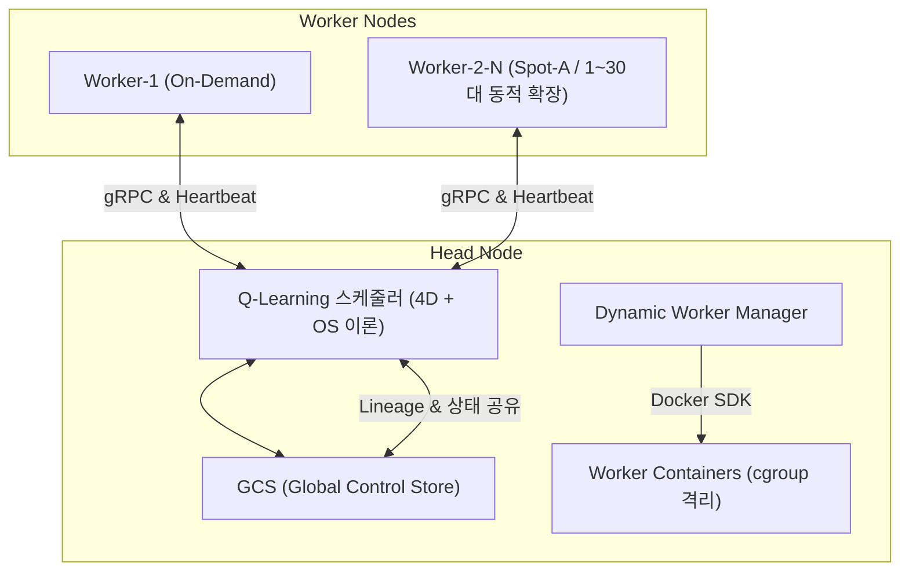

# Baby Ray 프로젝트 수행계획서 및 기술제안서 (통합 개편본)

본 문서는 이기종 가상 클러스터 기반 ML 분산 학습 제어 엔진인 **WE-MEET**의 프로젝트 수행 계획과 기술 설계 명세서입니다. 탄력적인 가상 클라우드 인프라의 요금제 및 이질성을 활용하여, OOM 병목을 회피하고 가용 비용 대비 분산 학습 Throughput을 자동 극대화하는 탄력적 지능형 제어 엔진을 목표로 정립하였습니다. 기존 수행 계획 및 구현 리스트와 일정을 보존한 상태에서, OS 스케줄링 기법 및 4차원 상태 공간 Q-Learning 설계를 보완하여 재정립하였습니다.

---

# [Part 1] 프로젝트 수행계획서

## 1. 과제 개요 및 주요 목표
*   단일 Windows 호스트 PC 환경(WSL2 기반 Docker) 하에서 gRPC, 리눅스 cGroup 자원 격리, 그리고 강화학습(Q-Learning) 및 OS 스케줄링 이론을 융합하여 탄력적인 가상 클라우드 인프라의 요금제 및 이질성을 활용하고, OOM 병목을 회피하여 가용 비용 대비 분산 학습 Throughput을 자동 극대화하는 탄력적 지능형 제어 엔진을 구현합니다.
*   학습 모델(CNN, RNN, LSTM)의 고유한 자원 요구도 특성에 대응하여 물리적인 자원 격리를 시연하고 최적의 가변 요금제(Spot 요금제) 스케줄링 정책을 학습해 냄으로써 실제 분산 컴퓨팅 런타임의 최적 자원 배분 메커니즘을 증명하는 것을 최종 목표로 합니다.

## 2. 주요 추진 목표 및 핵심 구현 리스트
*   **이기종 가상 성능 시뮬레이션**: 단일 호스트(RTX 4060 Laptop) 내에서 `torch.cuda.synchronize()` 후 `gpu_scale_factor`에 비례한 인위적 지연(`sleep`)을 삽입하여 성능 편차 구현.
    *   **Worker-1**: On-Demand (Scale 1.0, CPU 2.0 Cores, Mem 2GB)
    *   **Worker-2**: Spot-A (Scale 0.6, CPU 1.0 Core, Mem 1GB, 최대 30대 동적 확장 및 번호 재사용)
*   **3대 머신러닝 워크로드 구성**:
    *   **이미지 분류 (CNN)**: SimpleCNN (GPU 연산 집약형, Spot 절감 검증용)
    *   **시계열 예측 (RNN)**: SimpleRNN (CPU/GPU 균형 연산형, 노드 이종성 검증용)
    *   **자연어 처리 (LSTM)**: SimpleLSTM (메모리 집약형, cGroup 제한 측정용)
*   **Task Lineage DAG 기반 장애 자가 복구**:
    *   Heartbeat 3초 미수신 시 DEAD 판정 ➔ GCS의 Task Lineage DAG 분석 ➔ 의존 하위 태스크 식별 ➔ 최신 체크포인트부터 학습 재개 및 Auto Scale-out 연동.
*   **고가용성 및 클러스터 안전 가드 장치 (Fault-Tolerance & Guard Systems)**:
    *   **비동기 좀비 컨테이너 클리너 (Async GCS Cleaner)**: Head Node 초기 구동 시, 호스트에 잔존하던 과거의 비정상 종료 Spot 컨테이너 잔해를 검출하여 **비동기 데몬 스레드로 백그라운드 소거**. gRPC 소켓 바인딩 및 서비스 시작을 차단하던 구버전 삭제 딜레이(3초 블로킹 병목)를 해결.
    *   **호스트 물리 메모리 Guard (Host Memory Guard)**: 스케일아웃 기동 시 실시간 호스트 메모리를 측정하여 가용 여유 용량이 **2.0 GB 미만**일 때 추가 컨테이너 배포를 거부하고 보류하여 호스트 OS의 OOM 붕괴 방지.
    *   **가용 GPU VRAM Guard (VRAM Guard)**: `nvidia-smi` API 및 시뮬레이션을 통해 가용 GPU 메모리가 **500 MiB 미만**일 때 스케일아웃을 긴급 차단하여 VRAM 고갈에 따른 CUDA 연산 크래시 차단.
    *   **작업 분배 롤백 방어 (Task Rollback Guard)**: 다중 배정(Multi-Dispatch) 과정에서 경합 조건 등으로 인해 특정 워커로의 태스크 바인딩 및 연산 위임에 실패할 경우, 작업을 삭제하지 않고 GCS 대기열의 맨 앞(`insert(0, task)`)으로 즉각 안전하게 회수 및 롤백.

## 3. 주차별 추진 일정 (상세 일정표)

| 주차/일차 | 팀 목표 및 활동 | 성시준 (팀장) 역할 | 김현진 (팀원) 역할 | 투입시간 |
| :--- | :--- | :--- | :--- | :--- |
| **0주차** | 가상 자원 분산 환경 가설 검토 및 계획서 구체화 | gRPC 프로토콜 분석, 뼈대 설계 | 운영 자동화 및 도입 타당성 검토 | 4 |
| **1일차 (6.22)** | 프로젝트 주제 구체화 및 방향성 탐색 | 팀 빌딩 및 분산 컴퓨팅 연구 방향 정의 | 로컬 가상화 도입 타당성 검토 | 6 |
| **2일차 (6.23)** | 가상 분산 런타임 통신 구조 선행 분석 | gRPC 및 생존 확인 통신 구조 기획 | 인프라 배포 자동화 스크립트 설계 | 8 |
| **3일차 (6.24)** | 통신 인터페이스 메시지 규격 설계 | Protobuf 기반 데이터 송수신 규격 설계 | 가상 인프라 모니터링 변수 정의 | 8 |
| **4일차 (6.25)** | 가상 인프라 자원 연동 구조 설계 | Docker cGroup 자원 제한 메커니즘 설계 | 단독 노드 기반 AI 연산 파이프라인 개발 | 8 |
| **5일차 (6.26)** | 0주차 마일스톤 점검 및 저장소 초기화 | 수행계획서 취합 및 GitHub 저장소 설정 | 학습 데이터셋 합성 및 전처리 완료 | 8 |
| **6일차 (6.29)** | 강화학습 의사결정 액션 최적화 및 감쇄 도입 | Action Space 4개 축소 및 Epsilon Decay 설계 구현 | 에이전트 모듈 리팩토링 및 캘리브레이션 | 8 |
| **7일차 (6.30)** | 코드 표준화 및 다큐멘테이션 보강 | 기존 주석 완벽 보존하며 표준 Docstring 추가 | PDF 명세서 추출용 포맷 정돈 | 8 |
| **8일차 (7.01)** | 의존성 기반 Task Lineage DAG 개발 | Lineage 의존성 탐색 및 Cascaded Recovery 구현 | 장애 상황별 복구 시나리오 테스트 보조 | 8 |
| **9일차 (7.02)** | 오프라인 가상 시뮬레이션 기반 고속 학습 | 사전 학습 시뮬레이터 작성 및 Q-Table 최적 수렴 | 에피소드 반복 횟수별 학습 데이터 추출 | 10 |
| **10일차 (7.03)** | 실환경 컨테이너 연동 및 검증 | GCS 연동 미세 조정 및 가상 OOM 안정성 검증 | 실환경 벤치마크 학습 로그 분석 | 6 |
| **11일차 (7.06)** | 연산 부하 평준화 및 자원 균일화 모델 보강 | 3대 ML 워크로드 파라미터 튜닝 및 OOM 방어 적용 | 모의 부하에 따른 cGroup 자원 분석 | 8 |
| **12일차 (7.07)** | 시뮬레이터 속도 지연 캘리브레이션 | 이기종 노드별 수행 시간 및 비용 추이 매핑 | 벤치마크 테스트 데이터 로깅 자동화 | 8 |
| **13일차 (7.08)** | 스케줄러 알고리즘 비교 실험 (RL vs HEUR) | Q-Learning vs FIFO/Random 비교 실험 수행 | 알고리즘별 SLA 준수율 및 비용 통계 정리 | 8 |
| **14일차 (7.09)** | 분산 클러스터 탄력성 벤치마크 수행 | Spot 워커 30대 증설 환경 가상 확장 및 부하 테스트 | 오토스케일링 딜레이에 따른 병목 수치화 | 7 |
| **15일차 (7.10)** | 통합 자원 가드 보호 기전 극한 검증 | Host/GPU 메모리 경계 조건 강제 진입 및 차단 검증 | OOM Preemption Guard 무결성 평가 | 8 |
| **16일차 (7.13)** | 벤치마크 데이터 시각화 | Throughput 및 비용 소모 추이 시각화 그래프 구현 | 최종 분석용 벤치마크 이미지 패키징 | 8 |
| **17일차 (7.14)** | 시스템 개선 및 멘토링 피드백 반영 | 의사결정 수렴 상태 최종 점검 및 미세 튜닝 | 시각화 보고서 오류 보정 및 수정 | 8 |
| **18일차 (7.15)** | 최종 시스템 배포 빌드 정돈 | Docker Compose 및 SDK 통합 구동 스크립트 작성 | 최종 런타임 안정성 총괄 점검 | 8 |
| **19일차 (7.16)** | 최종 결과 보고서 종합 작성 | 기술 산출물 문서 패키징 및 보고서 검토 | 결과보고서 본문 기술 문서 종합 작성 | 8 |
| **20일차 (7.17)** | 프로젝트 최종 제출 및 마감 | 최종 보고서 검토 및 최종 검수 | 최종 과제물 및 산출물 업로드 완료 | 4 |

---

# [Part 2] 기술제안서 (Technical Proposal)

## 1. 분산 아키텍처 및 제어 토폴로지

본 프로젝트는 **1 Head Node - $N$ Worker Nodes** 구조의 분산 런타임을 구축합니다.
GCS(Global Control Store)는 분산 컴퓨팅의 모든 메타데이터(노드 상태, 작업 대기열, Task Lineage, 체크포인트 경로)를 유지하는 중앙 동기화 계층으로 동작하며, Head Node 내에 인메모리 스토어로 내장됩니다.



---

## 2. gRPC 기반 고성능 통신 인터페이스 및 프로토콜 규격

### 가. 프로토콜 타임아웃 및 메트릭 전송 수치 정의
1.  **Heartbeat 전송 주기**: 모든 활성 Worker는 **1.0초(1,000ms)** 간격으로 Head Node에 자신의 CPU/Memory 자원 사용률 및 노드 유형을 포함한 상태 패킷을 송신합니다.
2.  **생존 유실 판정 임계치 (Heartbeat Timeout)**: Head Node가 특정 Worker로부터 **3.0초(3,000ms)** 동안 Heartbeat를 수신하지 못하면, 해당 노드를 `DEAD` 상태로 간주하고 장애 복구 프로토콜을 수행합니다.
3.  **태스크 할당 및 수거 지연**: gRPC API 호출의 타임아웃은 **2.0초**로 제한하며, 실패 시 스케줄러 대기열로 작업을 롤백합니다.

### 나. Protobuf 인터페이스 규격 (`babyray.proto`)
```protobuf
syntax = "proto3";

package babyray;

service BabyRayService {
  rpc RegisterWorker (RegisterRequest) returns (RegisterResponse);
  rpc SendHeartbeat (HeartbeatRequest) returns (HeartbeatResponse);
  rpc AssignTask (TaskAssignment) returns (TaskResult);
  rpc GetTaskStatus (TaskStatusRequest) returns (TaskStatusResponse);
}

message RegisterRequest {
  string worker_id = 1;
  string node_type = 2; // on_demand, spot_a
  int32 port = 3;
}

message RegisterResponse {
  bool success = 1;
  string message = 2;
}

message HeartbeatRequest {
  string worker_id = 1;
  float cpu_utilization = 2;
  float memory_utilization = 3;
}

message HeartbeatResponse {
  bool ack = 1;
}

message TaskAssignment {
  string task_id = 1;
  string model_type = 2; // CNN, RNN, LSTM
  string dataset_path = 3;
  int32 epochs = 4;
}

message TaskResult {
  string task_id = 1;
  string status = 2; // SUCCESS, FAILED
  float execution_time = 3;
}

message TaskStatusRequest {
  string task_id = 1;
}

message TaskStatusResponse {
  string status = 1; // RUNNING, COMPLETED, FAILED
  float progress = 2;
}
```

---

## 3. 리눅스 커널 cgroup 기반 이기종 자원 격리 및 WSL2 가용성 가드

이기종 클러스터의 물리 성능 편차와 격리 안정성을 실증하기 위해 Docker의 cGroup 제한을 세분화하여 정의합니다.

### 가. 노드별 물리 자원 격리 스펙 및 요금 모델 (`cost_model.yaml`)
1.  **On-Demand (기본 코어 노드)**: `cpus: 2.0`, `mem_limit: 2048M`, 가상 요금 **$1.0/hour**. (가장 안정적이며 대용량 메모리 보장)
2.  **Spot-A (연산형 가속 노드)**: `cpus: 1.0`, `mem_limit: 1024M`, 가상 요금 **$0.4/hour**. (GPU 가속 위주, 메모리 제약 있음)
3.  **Spot-B (최소 경량 노드)**: `cpus: 0.5`, `mem_limit: 512M`, 가상 요금 **$0.2/hour**. (단순 에포크 연산용)

### 나. WSL2 / Docker RAM 안전 모니터링 가드
Windows 호스트 시스템에서 WSL2가 램을 임의 점유하여 전체 OOM을 유발하는 문제를 막기 위해, 클러스터 매니저는 스케일 아웃 지시 전 `wsl free -b` 명령어를 동적으로 파싱합니다.
*   WSL2 내부 가용 RAM이 **2.0GB 미만**으로 감지될 경우, 추가적인 Spot 노드의 스케일 아웃을 선제적으로 거부하여 호스트의 안전을 가드합니다.

---

## 4. 3대 스케줄러 메커니즘 특성 비교

| 비교 항목 | Static 스케줄러 모드 | Dynamic 스케줄러 모드 | Q-Learning (4D + OS 이론) 스케줄러 모드 |
| :--- | :--- | :--- | :--- |
| **의사결정 방식** | 큐 대기 크기 기준 정적 임계치 룰 | 노드 평균 자원(CPU/MEM) 부하 임계치 룰 | 4차원 상태 인지 및 행동 정책 기계 학습 |
| **스케일 아웃 조건** | 큐에 대기 중인 태스크 수 $\ge 5$ | 클러스터 평균 CPU 또는 MEM $\gt 70\%$ | 예산이 풍족하고 요금이 저렴할 때 동적 기동 |
| **스케일 인 조건** | 큐가 비어있고 유휴 상태가 10.0초 유지 | 큐가 비어있고 평균 CPU/MEM $\lt 20\%$ 가 10초 유지 | 예산 고갈 위험 또는 요금 폭등 시 자동 회수 |
| **자원 효율성** | 낮음 (큐 크기만 보고 확장하므로 자원 낭비) | 보통 (실시간 자원 부하를 추적하여 분산함) | **높음** (모형의 성격에 맞춰 하드웨어 친화적 격리 배정) |
| **Starvation 해결** | 없음 (FIFO 순차 처리로 인한 지연) | 없음 | **있음 (OS Aging 기법 결합)**: 임계 지연 시 강제 배정 |
| **선두 차단(HOL) 해결**| 없음 | 없음 | **있음 (OS Backfilling 결합)**: 후순위 태스크 우회 배정 |
| **한계 및 단점** | 워크로드 폭증 시 유연한 대처 불가 | 일시적인 부하 요동에 따른 노드 플래핑(Flapping) | 학습 수렴 전까지 탐험(Exploration) 오버헤드 존재 |

---

## 5. 4차원 상태 공간(State Space) 및 OS 스케줄링 이론 접목

Q-Learning 에이전트의 상태 변별력을 극대화하여 실제 시스템상의 병목 현상을 방지하도록 수학 모델을 고도화합니다.

### 가. 4차원 상태 공간 공식 정의
$$State = (T_{profile}, W_{active}, P_{spot}, B_{level})$$

1.  **$T_{profile}$ (대기열 워크로드 프로파일)**: 큐에 대기 중인 태스크들의 자원 요구 특성 분류.
    *   `0`: CNN(비전, 연산 및 GPU 가속 지향)이 대다수
    *   `1`: LSTM/RNN(자연어, 메모리 대역폭 지향)이 대다수
2.  **$W_{active}$ (클러스터 노드 활성 비트맵)**: 현재 기동되어 IDLE 상태로 대기하고 있는 노드 풀의 조합 정보.
3.  **$P_{spot}$ (실시간 가상 요금제 변동 및 중단 위험도)**:
    *   `0`: 요금 안정기 (스팟 기동에 유리)
    *   `1`: 요금 폭등 및 변동성 심화 (스팟 기동 자제)
4.  **$B_{level}$ (예산 잔여 레벨)**: 잔여 가상 예산 구간 (0: 고갈, 1: 경고, 2: 풍족).

### 나. 운영체제(OS) 스케줄링 기법의 결합 및 극복

#### 1) Backfilling (비순차 스케줄링) 을 통한 HOL Blocking 극복
*   **문제**: 큐 선두의 LSTM 작업이 가용 On-Demand 자원이 없어 대기할 때, 후순위의 CNN 작업이 비어 있는 Spot-A 노드를 활용하지 못하고 대기열에서 노는 병목 발생.
*   **해법**: 스케줄러 루프 내에 **Backfilling 알고리즘**을 결합합니다. 최선두 태스크 배정이 보류될 경우, 큐 내부를 후방 탐색하여 현재 비어 있는 Spot-A 노드 스펙에 딱 맞는 CNN 작업을 선제 배정하여 클러스터 가동률을 극대화합니다.

#### 2) Aging (에이징) 패널티를 통한 Starvation 극복
*   **문제**: 강화학습 에이전트가 예산 보존(Reward 상승)을 위해 무겁고 요금이 비싼 RNN/LSTM 작업을 무한정 보류(Action 2: HOLD)시키는 기아 현상 발생.
*   **해법**: 보상 함수 $Reward$ 계산 시 **Aging 패널티**를 산출하여 주입합니다.
    $$Reward = R_{SLA} - (Cost_{run} + Penalty_{late} + Penalty_{wait})$$
    *   태스크의 대기 시간($time.time() - task["enqueue_time"]$)이 임계점(30초)을 초과한 상태에서 에이전트가 `HOLD` 액션을 선택할 경우, 초당 $-10.0$의 강력한 누적 **$Penalty_{wait}$**를 부과하여 에이전트가 균형 잡힌 공정 배정을 학습하도록 강제합니다.

---

## 6. GCS & Task Lineage 기반 장애 자가 복구 (Fault Tolerance)

스팟 노드가 중단될 때 중간 연산 결과를 보존하고 복구하는 계보 관리 설계입니다.

1.  **계보(Lineage) 관리**: 모든 태스크는 GCS에 부모/자식 관계의 DAG 링크 정보와 산출 가중치 정보(`.pt`) 캐시 유무를 등록합니다.
2.  **연쇄 실패 방지**: 특정 노드 중단으로 `FAILED`가 감지되면, 스케줄러는 유실된 노드에서 수행 중이던 서브 DAG 트리의 직전 완료 단계 가중치 파일(`.pt`)을 찾아내어 대체 노드에서 학습을 이어서 재개(Re-execution)시킴으로써 가용성을 극대화합니다.

---

## 7. 3대 ML 워크로드 성능 시뮬레이션 지연 계산식

이기종 물리 노드의 성능 속도 편차를 모사하기 위해 연산 루프 끝에 PyTorch 강제 동기화 지연을 구현합니다.

$$\text{Actual Epoch Time} = \text{Base Epoch Time} \times \left( \frac{1}{\text{GPU Scale Factor}} \right) + \text{Sleep Delay}$$

*   **이미지 분류 (CNN)**: SimpleCNN + MNIST 데이터셋 모사. Base Epoch 2.0초. Spot-A(0.6) 가동 시 1 Epoch 당 3.3초 소요. (연산량 집중)
*   **시계열 예측 (RNN)**: SimpleRNN + 사인파 합성 데이터 모사. Base Epoch 3.0초. Spot-A(0.6) 가동 시 1 Epoch 당 5.0초 소요.
*   **자연어 처리 (LSTM)**: SimpleLSTM + 텍스트 데이터 모사. Base Epoch 4.0초. Spot-A(0.6) 가동 시 1 Epoch 당 6.7초 소요. (메모리 사용 유도)

---

## 8. WE-MEET 고도화 3대 로드맵 (출장 주간 연구 및 고도화 과제)

본 섹션은 WE-MEET 아키텍처의 학술적/실무적 깊이를 극대화하기 위해 출장 주간 동안 수립 및 보강할 3대 고도화 기술 과제를 정의합니다.

### 가. Ray 논문 사상 구현 (Head-free Data Flow)
* **목표**: 마스터(Head) 노드의 중간 데이터 전송/병합 오버헤드와 Bottleneck(병목)을 완전히 배제하고, Ray의 설계 철학을 준수합니다.
* **상세 방안**:
  * Head 노드는 오직 gRPC 메타데이터 및 DAG 실행/태스크 할당 흐름(Control Plane)만 제어하도록 차단합니다.
  * AI 가중치(weights) 및 데이터셋(`.pt`)의 실질적인 수집, 병합, 전달 등은 Head 노드를 경유하지 않고, 워커 노드 간 직접 gRPC 연결(P2P) 또는 NFS(공유 분산 저장소)를 통해 병렬로 통신(Data Plane)하도록 유도합니다.

### 나. 모델 특성별 cGroup 리소스 파티셔닝 (CNN, RNN, LSTM 융합)
* **목표**: 비전 모형(CNN)과 시퀀스/텍스트 모형(RNN, LSTM)이 요구하는 물리적 하드웨어 접근 패턴 및 메모리 팽창 특성이 다름에 따라, 격리 리소스 설정을 동적으로 다르게 가져갑니다.
* **상세 방안**:
  * **비전 특화(CNN) cGroup 프로파일**: CPU 연산 점유는 최소화하되 GPU CUDA 패스스루 한도를 최대로 유지하여 가속 처리에 최적화합니다.
  * **텍스트 특화(RNN/LSTM) cGroup 프로파일**: 그라디언트 및 시퀀스 처리에 따른 OOM을 미연에 방지하기 위해 CPU 연산 가중치와 RAM 제한(limits)을 상대적으로 상향 적용하되 Swap 메모리를 예비용으로 바인딩합니다.
  * **융합형 스케줄링**: 대기열의 태스크 유형을 식별해 이에 맞는 최적의 cGroup 리소스 프로파일을 바인딩하고 있는 워커 풀로 적격 배정하는 융합 알고리즘을 도입합니다.

### 다. 고가용성(HA) 및 탄력성(Scale-In/Out) 안정성 강화
* **목표**: 노드 오프라인 장애 시 완벽한 계보 복구 및 자동 자원 회수/증설(Auto-scaling)의 플래핑(Flapping) 현상을 제어합니다.
* **상세 방안**:
  * **자가 치유 계보(Fault-Tolerance Lineage)**: 워커가 다운되었을 때 이미 완료된 캐시 데이터를 보존한 채, 유실된 서브 DAG 트리의 미완료 연산만 복구하여 인접 노드에 점진적으로 재배정하는 Lineage 기반 자가 치유를 고도화합니다.
  * **탄력성 가드(Auto-scaling Safeguard)**: 노드가 잦은 주기로 생성/삭제(Flapping)되어 발생하는 호스트 부하를 막기 위해 기동 후 최소 유지 시간(Cooldown Time)을 부여하고, 호스트 VM 내부의 실질적 가용 자원 잔여량(`wsl free -b`)을 지속 추적하여 리소스 고갈 상황에서는 선제적으로 스케일 아웃을 보류하는 안전 안전장치를 적용합니다.
