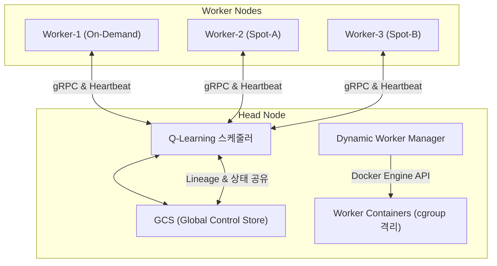
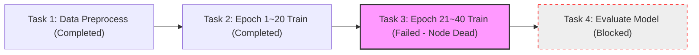

# [통합 패키지] WE-Meet 수행 계획서 & 기술 제안서

> **본 계획서는 Docker 기반 경량 분산 런타임(Baby Ray) 구축 및 자원 인지형 동적 스케줄러 개발 프로젝트의 학사 행정용 팀 수행계획서와 이를 실현하기 위한 정량적/수치적 기술 제안서를 통합한 문서입니다.**

---

# [참고 1-1] 하기 계절학기 캡스톤디자인/WE-Meet 수행 계획서 (팀)

## 1. 프로젝트 과제 명칭
**Docker 기반 경량 분산 런타임(Baby Ray) 구축 및 자원 인지형 동적 스케줄러 개발**

* **설계 참고 자료:** 본 프로젝트는 분산 처리 프레임워크 Ray의 핵심 구조(GCS, locality-aware 스케줄링, lineage 기반 장애복구)와, 이를 Go로 재구현한 Stanford CS244B 프로젝트 「Baby Ray: Re-implementing a distributed Python runtime in Go」(2024)를 설계 참고 자료로 활용함.

---

## 2. 팀원 구성 및 업무분장 내역

| No. | 학번 | 성명 | 담당 업무 |
| :--- | :--- | :--- | :--- |
| **1** | 202402070 | 성시준 | **[팀장 / 분산 시스템 코어 개발]**<br>• Docker 기반 가상 분산 노드 구축 및 cGroup(CPU/Memory) 자원 제한 세팅<br>• gRPC/Protobuf 기반 노드 간 고속 양방향 통신 인터페이스 설계 및 구현<br>• 이기종 자원 상태를 감지하여 연산을 분배하는 자원 인지형 동적 스케줄러 엔진 개발<br>• 가상 노드 정지 상황에 대응하는 고가용성(HA) 작업 복구 알고리즘 구현 |
| **2** | 202402056 | 김현진 | **[팀원 / 가상 인프라 자동화 및 모니터링 분석]**<br>• 코드 기반 인프라(IaC) 제어 개념을 응용한 Docker 가상 분산 클러스터 배포 자동화 및 관리 스크립트 작성<br>• 가상 노드별 실시간 자원 사용량(CPU/Memory) 메트릭 수집 및 모니터링 모듈 구축<br>• 분산 환경 장애 상황 감지 시나리오 및 AI 연산 벤치마크 테스트 수행 보조<br>• 스케줄러 및 복구 조건별 성능 데이터 분석 및 최종 결과 보고서 기술 문서화 작성 |

---

## 3. 프로젝트 추진 배경 및 필요성

### 가. 기술적 배경
현대 AI 분산 시스템은 단일 장비의 한계를 초월한 대규모 연산 처리를 위해 핵심 기술 스택을 필수적으로 채택하고 있습니다. 본 프로젝트는 이러한 기술들을 클라우드 서비스의 상위 API 수준에서 소비하는 것에 그치지 않고, 소스 코드 레벨에서 직접 설계하고 동작을 실증하는 것을 목표로 합니다.
1. **분산 컴퓨팅 런타임 + Auto Scaling 기반 동적 클러스터**: Ray의 핵심 설계를 참고하여 Docker Compose 기반의 경량 분산 런타임을 직접 구현합니다. 특히 태스크 대기열 부하량에 따라 Worker 컨테이너를 자동으로 추가·제거하는 Auto Scaling 메커니즘을 설계하여 실제 클라우드 환경을 재현합니다.
2. **고속 노드 간 통신 (gRPC/Protobuf)**: Head 노드와 Worker 노드 간의 제어 명령 및 상태 데이터 교환을 위해, 텍스트 기반 JSON/REST 방식의 병목을 극복하는 이진 직렬화(Protobuf)와 멀티플렉싱 스트리밍을 지원하는 gRPC 통신 인터페이스를 구현합니다.
3. **실시간 생존 감지 (Heartbeat)와 고가용성 (HA)**: OOM이나 프로세스 비정상 종료 등 분산 환경에서 발생하는 장애를 감지하기 위한 Heartbeat 메트릭 파이프라인과 고가용성 자가 복구 메커니즘을 구현하여 시스템 마비를 방지합니다.
4. **컨테이너 자원 격리 (cgroup)**: 리눅스 커널의 cgroup 기술을 활용하여 컨테이너별 CPU 코어와 메모리를 강제 제한한 비대칭 클러스터 환경을 구성하고, 이기종 노드 간 자원 간섭을 차단합니다.
5. **Q-learning 기반 비용 인지형 스케줄러**: 설정 파일(`cost_model.yaml`)에 노드 유형(On-Demand/Spot)별 가상 요금 모델과 성능 프로파일을 정의하고, 이를 학습 데이터로 삼는 Q-learning 에이전트를 구현하여 태스크 마감 시한(Deadline) 내 총 가상 비용을 최소화하는 정책을 탐색합니다.

### 나. 요구사항 분석
* **[과제 1] Auto Scaling 기반 동적 노드 관리**: 임계값 초과 시 `docker compose up --scale` 명령으로 Worker를 자동 증설하고, 부하 해소 시 유휴 Worker를 자동 회수(Scale-in)하는 Join 프로토콜 설계.
* **[과제 2] Q-learning 비용 인지형 스케줄러**: State(대기 태스크, 자원 사용률, 비용 등), Action(태스크 할당, 오프로딩, Scale-out/in 트리거), Reward(Deadline 준수 보너스, 비용 및 남용 패널티) 체계 설계 및 비용 추정.
* **[과제 3] 노드 장애 시 중간 연산 유실 방지**: Worker 강제 종료 시 GCS에 기록된 Task Lineage를 역추적하여 유실된 태스크만 선택적으로 재할당 및 체크포인트 기반 복구.
* **[과제 4] 인프라 일관성 재현 (IaC 기반 자동화)**: Docker Compose와 자원 제한 설정을 스크립트화하여 비대칭 클러스터 환경을 원클릭으로 재현하고 Scale-out 노드에도 동일 템플릿 자동 적용.

### 다. 수행 필요성
* 퍼블릭 클라우드의 상위 API 사용에 머무르지 않고, 가상 분산 환경의 핵심 컴포넌트(IaC, cGroup, gRPC, Task Lineage, Auto Scaling, Q-learning)를 바닥부터 직접 구현하여 DevOps 및 클라우드 시스템 엔지니어링 역량을 극대화함.

---

## 4. 최종 목표 및 주요 결과물

### 가. 최종 목표
* Docker 가상 분산 환경에서 cGroup 기반 자원 격리, Auto Scaling 기반 동적 노드 관리, Q-learning 비용 인지형 스케줄러, Task Lineage 기반 고가용성(HA) 자가 복구 모듈을 통합 구축하여 성능·비용·안정성을 실증함.

### 나. 주요 결과물의 우선순위
* **Tier 1 (필수 결과물)**
  * gRPC 통신 프로토콜 + Heartbeat 파이프라인 구현
  * cGroup 자원 격리 + PyTorch 학습 태스크 연동
  * Auto Scaling: 대기열 기반 Worker 자동 증설·회수
  * Q-learning CASF 스케줄러 (가상 비용 모델 포함)
  * Task Lineage 기반 자동 장애 복구 (기본형)
* **Tier 2 (심화 결과물)**
  * Lineage DAG 역추적 심화 (의존 태스크 연쇄 복구)
  * Scale-out ↔ 장애복구 완전 자동 연동 (통합 제어 루프)
  * *※ 일정상 어려울 경우 Tier 1 결과만으로 결과보고서 작성*

### 다. 세부 설계 내용
* **gRPC 통신 프로토콜 및 API 명세**
  * `SendHeartbeat`: Worker → Head (CPU, Memory, 노드 유형 송신)
  * `AssignTask`: Head → Worker (Task ID, 모델, 데이터셋 경로 등 전달)
  * `GetTaskStatus`: Head → Worker (실행 상태, 진행률, 로그 확인)
  * `ResizeResources`: Head → Worker (Scale-in 시 cGroup 자원 제한 조정)
  * `RegisterWorker` / `DeregisterWorker`: Worker 등록 및 제거 프로토콜
* **Auto Scaling 기반 동적 클러스터 설계**
  * **Scale-out**: 대기열 길이 > N 또는 평균 CPU > 80% 지속 시 Worker 증설
  * **Scale-in**: 전체 CPU < 20% 및 대기 태스크 = 0 지속 시 유휴 Worker 제거
  * **cGroup 템플릿**: Scale-out 시 Spot 프로파일(CPU 1.0 Core / Memory 1GB) 자동 적용
* **이기종 가상 성능 시뮬레이터 구성**
  * 단일 호스트(RTX 4060 Laptop) 내에서 `torch.cuda.synchronize()` 후 `gpu_scale_factor`에 비례한 인위적 지연(`sleep`)을 삽입하여 성능 편차 구현.
  * **Worker-1**: On-Demand (Scale 1.0, CPU 2.0 Cores, Mem 2GB)
  * **Worker-2 / 3**: Spot-A / Spot-B (Scale 0.6 / 0.3, CPU 1.0 Core, Mem 1GB)
* **3대 머신러닝 워크로드 구성**
  * **이미지 분류 (CNN)**: SimpleCNN (GPU 연산 집약형, Spot 절감 검증용)
  * **시계열 예측 (RNN)**: SimpleRNN (CPU/GPU 균형 연산형, 노드 이종성 검증용)
  * **자연어 처리 (LSTM)**: SimpleLSTM (메모리 집약형, cGroup 제한 측정용)
* **Task Lineage DAG 기반 장애 자가 복구**
  * Heartbeat 3초 미수신 시 DEAD 판정 $\rightarrow$ GCS의 Task Lineage DAG 분석 $\rightarrow$ 의존 하위 태스크 식별 $\rightarrow$ 최신 체크포인트부터 학습 재개 및 Auto Scale-out 연동.

---

## 5. 주차별 추진 일정 (상세 내용)

| 주차/일차 | 팀 목표 및 활동 | 성시준 (팀장) 역할 | 김현진 (팀원) 역할 | 투입시간 |
| :--- | :--- | :--- | :--- | :--- |
| **0주차** | 가상 자원 분산 환경 가설 검토 및 계획서 구체화 | gRPC 프로토콜 분석, 뼈대 설계 | 운영 자동화 및 도입 타당성 검토 | 4 |
| **1일차 (6.22)** | 프로젝트 주제 구체화 및 방향성 탐색 | 팀 빌딩 및 분산 컴퓨팅 연구 방향 정의 | 로컬 가상화 도입 타당성 검토 | 6 |
| **2일차 (6.23)** | 가상 분산 런타임 통신 구조 선행 분석 | gRPC 및 생존 확인 통신 구조 기획 | 인프라 배포 자동화 스크립트 설계 | 8 |
| **3일차 (6.24)** | 통신 인터페이스 메시지 규격 설계 | Protobuf 기반 데이터 송수신 규격 설계 | 가상 인프라 모니터링 변수 정의 | 8 |
| **4일차 (6.25)** | 가상 인프라 자원 연동 구조 설계 | Docker cGroup 자원 제한 메커니즘 설계 | 단독 노드 기반 AI 연산 파이프라인 개발 | 8 |
| **5일차 (6.26)** | 0주차 마일스톤 점검 및 저장소 초기화 | 수행계획서 취합 및 GitHub 저장소 설정 | 학습 데이터셋 합성 및 전처리 완료 | 8 |
| **6일차 (6.29)** | Docker 가상 네트워크 구축 및 기동 | Docker Compose 기반 가상 사설망 세팅 | 컨테이너 Dockerfile 정의 및 빌드 | 8 |
| **7일차 (6.30)** | 컨테이너 환경 정합성 검사 및 통신망 구축 | 연산 실행 구조 검사 및 디버깅 | 자동화 스크립트를 통한 셋업 검증 | 8 |
| **8일차 (7.01)** | 노드 간 고속 핑퐁 통신망 연동 검증 | gRPC/Protobuf 기반 양방향 통신 코딩 | 포트 매핑 테스트 및 트러블슈팅 보조 | 8 |
| **9일차 (7.02)** | 실시간 노드 생존 수집 파이프라인 구축 | 실시간 하트비트 생존 메트릭 수집기 개발 | 노드별 생존 확인 메트릭 모니터링 검증 | 10 |
| **10일차 (7.03)** | 1주차 가상 인프라 통신 빌드 및 검증 | 하트비트 두절 예외 처리 및 환경 검증 | 1주차 전체 통신 테스트 로그 분석 | 6 |
| **11일차 (7.06)** | Docker cGroup 활용 노드 성능 격리 세팅 | cGroup 연동 설정 및 성능 제한 스크립트 | 노드별 자원 점유 로깅 스크립트 개발 | 8 |
| **12일차 (7.07)** | 자원량 비례 스케줄러 연동 제어 최적화 | 동적 Q-learning 스케줄러 엔진 개발 | 가상 비용 모델 기반 벤치마크 수행 | 8 |
| **13일차 (7.08)** | ① 동적 부하 분산 스케줄링 구현 및 검증 | 스케줄러 대기열 분배 로직 구현 | 부하 생성 모듈 설계 및 대기열 검증 | 8 |
| **14일차 (7.09)** | ② 노드 장애 발생 탐지 예외 시나리오 검사 | 특정 컨테이너 강제 중단 예외 제어 코딩 | 장애 주입 시 실시간 크래시 로그 검출 | 7 |
| **15일차 (7.10)** | ③ Task Lineage 기반 자동 복구 완수 | Task Lineage DAG 역추적 기반 복구 완수 | 복구 완료 후 연산 무결성 및 성능 검증 | 8 |
| **16일차 (7.13)** | 스케줄러 알고리즘별 성능 비교 검증 | 알고리즘별 가상 비용 비교 분석 | 스케줄러 속도 격차 및 요금 계측 정리 | 8 |
| **17일차 (7.14)** | 시스템 확장 성능 벤치마크 데이터 도출 | 노드 확장에 따른 Throughput 데이터 분석 | Throughput 추이 Python 시각화 그래프 작성 | 8 |
| **18일차 (7.15)** | 멘토링 피드백 반영 알고리즘 튜닝 | Q-learning 파라미터 및 보상 함수 튜닝 | 시각화 데이터 수치 검증 및 결과 보정 | 8 |
| **19일차 (7.16)** | 최종 보고서 취합 및 기술 문서 정리 | 기술 산출물 최종 패키징 및 보고서 검토 | 결과보고서 본문 기술 문서 종합 작성 | 8 |
| **20일차 (7.17)** | 프로젝트 최종 산출물 정리 및 제출 | 최종 보고서 검토 및 프로젝트 마감 | 최종 과제물 및 산출물 업로드 완료 | 4 |

---
---

# 기술 제안서 (Technical Proposal)

## 1. 분산 아키텍처 및 제어 토폴로지

본 프로젝트는 **1 Head Node - $N$ Worker Nodes** 구조의 분산 런타임을 구축합니다. 
GCS(Global Control Store)는 분산 컴퓨팅의 모든 메타데이터(노드 상태, 작업 대기열, Task Lineage, 체크포인트 경로)를 유지하는 중앙 동기화 계층으로 동작하며, Head Node 내에 인메모리 스토어로 내장됩니다.



---

## 2. gRPC 기반 고성능 통신 인터페이스 및 프로토콜 규격

### 가. 프로토콜 타임아웃 및 메트릭 전송 수치 정의
1. **Heartbeat 전송 주기**: 모든 활성 Worker는 **1.0초(1,000ms)** 간격으로 Head Node에 자신의 CPU/Memory 자원 사용률 및 노드 유형을 포함한 상태 패킷을 송신합니다.
2. **생존 유실 판정 임계치 (Heartbeat Timeout)**: Head Node가 특정 Worker로부터 **3.0초(3,000ms)** 동안 Heartbeat를 수신하지 못하면, 해당 노드를 `DEAD` 상태로 간주하고 장애 복구 프로토콜을 수행합니다.
3. **태스크 할당 및 수거 지연**: gRPC API 호출의 타임아웃은 **2.0초**로 제한하며, 실패 시 스케줄러 대기열로 작업을 롤백합니다.

### 나. Protobuf 규격 정의 (`babyray.proto`)
```protobuf
syntax = "proto3";

package babyray;

service BabyRayService {
  rpc RegisterWorker (RegisterRequest) returns (RegisterResponse);
  rpc SendHeartbeat (HeartbeatRequest) returns (HeartbeatResponse);
  rpc AssignTask (TaskAssignment) returns (TaskResult);
  rpc GetTaskStatus (TaskStatusRequest) returns (TaskStatusResponse);
}

message RegisterRequest {
  string worker_id = 1;
  string node_type = 2; // on_demand, spot_a, spot_b
  int32 port = 3;
}

message RegisterResponse {
  bool success = 1;
  string message = 2;
}

message HeartbeatRequest {
  string worker_id = 1;
  float cpu_utilization = 2;
  float memory_utilization = 3;
}

message HeartbeatResponse {
  bool ack = 1;
}

message TaskAssignment {
  string task_id = 1;
  string model_type = 2; // CNN, RNN, LSTM
  string dataset_path = 3;
  int32 epochs = 4;
}

message TaskResult {
  string task_id = 1;
  string status = 2; // SUCCESS, FAILED
  float execution_time = 3;
}

message TaskStatusRequest {
  string task_id = 1;
}

message TaskStatusResponse {
  string status = 1; // RUNNING, COMPLETED, FAILED
  float progress = 2;
}
```

---

## 3. 리눅스 커널 cgroup 기반의 이기종 자원 격리 규격

단일 Windows Host (RTX 4060 Laptop GPU, AMD/Intel 8 Cores/16 Threads CPU, 16GB RAM) 하의 WSL2 환경에서 이기종 클러스터를 실증하기 위해, Docker Compose/Docker API를 통한 물리 자원 격리(cgroup) 한계치를 구체적으로 설정합니다.

### 가. 노드별 물리 자원 격리 스펙 및 요금 모델 (`cost_model.yaml`)

| 노드 ID | 노드 유형 (Type) | CPU 격리 한계치 (cgroup) | 메모리 격리 한계치 (cgroup) | 가상 요금 ($ / hour) | 중단 위험도 (Preemption) | GPU Scale Factor |
| :--- | :--- | :--- | :--- | :--- | :--- | :--- |
| **Worker-1** | On-Demand | `cpus: 2.0` (2 Cores) | `mem_limit: 2048M` (2GB) | **$1.0** | 0% | 1.0 (지연 없음) |
| **Worker-2** | Spot-A | `cpus: 1.0` (1 Core) | `mem_limit: 1024M` (1GB) | **$0.4** | 30% | 0.6 (1.67배 지연) |
| **Worker-3** | Spot-B | `cpus: 0.5` (0.5 Core) | `mem_limit: 512M` (512MB) | **$0.2** | 70% | 0.3 (3.33배 지연) |

---

## 4. 탄력적 Auto Scaling 알고리즘

Head Node의 `Dynamic Worker Manager`는 큐에 적재된 대기 태스크 개수와 평균 노드 자원 부하를 모니터링하여 실시간으로 Worker 컨테이너를 가동 및 소멸시킵니다.

### 가. 스케일 아웃 (Scale-out) 규칙
* **트리거 임계치**: 대기열(Task Queue)에 적재된 태스크 개수가 **5개 초과** 상태로 **5.0초** 이상 지속되거나, 현재 활성화된 모든 Worker의 평균 CPU 사용률이 **80% 초과**할 때.
* **배포 기동 방식**: 호스트 Docker API (`client.containers.run`)를 직접 제어하여 지정된 Spot 프로파일 템플릿으로 새 컨테이너를 즉시 실행하고, gRPC 서버 포트는 `50060`번부터 충돌을 피해 순차적으로 바인딩합니다.

### 나. 스케일 인 (Scale-in) 규칙
* **트리거 임계치**: 대기열(Task Queue) 개수가 **0개**이며, 클러스터에 배포된 전체 Worker의 평균 CPU 사용률이 **20% 미만**인 상태가 **10.0초** 이상 지속될 때.
* **수거 방식**: 가장 유휴 상태인 Spot Worker부터 안전하게 gRPC 연결을 해제(`DeregisterWorker`)한 후, 컨테이너 정지(`docker stop`) 및 완전 삭제(`docker rm`)를 통해 호스트 자원을 회수합니다.

---

## 5. Q-learning 기반 비용/SLA 인지형 동적 스케줄러 수식 모델

비용과 마감 시한(Deadline) 내 완수(SLA 보장)를 동시에 조율하는 지능형 스케줄러의 강화학습 모델링입니다.

### 가. 수학적 모델 정의
1. **상태 공간 (State Space, $S$)**
   $$S = (Q_{len}, R_{active}, C_{budget})$$$Q_{len}$은 대기 큐 크기 (0~10 정수화), $R_{active}$는 활성 노드 풀 상태 (각 노드 타입별 실행 중 여부의 비트맵), $C_{budget}$은 잔여 가상 예산 레벨 (Low, Medium, High).

2. **행동 공간 (Action Space, $A$)**
   $$A = \{ a_1, a_2, a_3, a_{hold}, a_{scale\_out} \}$$
   * $a_i$: $i$번째 활성 워커에 현재 큐의 헤드 태스크 할당.
   * $a_{hold}$: 현재 비용이나 자원 포화 상태를 감안하여 배치를 대기하고 지연.
   * $a_{scale\_out}$: 새로운 Spot Worker를 추가 기동하도록 트리거.

3. **보상 함수 (Reward Function, $R$)**
   $$Reward = R_{SLA} - (Cost_{run} + Penalty_{late})$$
   * **SLA 완수 보너스 ($R_{SLA}$)**: 마감 시간(Deadline) 내 태스크를 완료하면 $+10.0$ 부여.
   * **수행 비용 감점 ($Cost_{run}$)**: 태스크 수행에 투입된 노드의 시간당 요금 비율 감점.
     $$Cost_{run} = \gamma_{cost} \times (Cost_{worker} \times Time_{execution})$$
   * **지연 감점 ($Penalty_{late}$)**: 마감 시한을 초과한 시간에 대해 초당 $-5.0$의 지중 감점 적용.

4. **학습 하이퍼파라미터**
   * 학습률 ($\alpha$): **0.1**
   * 할인율 ($\gamma$): **0.9**
   * 탐험율 ($\epsilon$): **0.15** (최적 행동 선택 85%, 무작위 탐색 15%)

---

## 6. GCS & Task Lineage 기반 장애 자가 복구 (Fault Tolerance)

스팟 노드가 중단될 때, 연산 결과를 처음부터 다시 계산하지 않고 유실된 중간 부분만 선택적으로 복구하는 메커니즘입니다.



1. **Task Lineage DAG 관리**: 모든 태스크는 고유 ID를 가지며, 자신의 부모 태스크 ID(의존성)를 GCS에 명시합니다. (예: `Task-4`는 `Task-3`의 결과 데이터를 입력으로 사용)
2. **장애 감지 시 복구 절차**
   * `Worker-3` 사망 감지 $\rightarrow$ `Worker-3`에서 실행 중이던 `Task-3` 상태를 `FAILED`로 변경.
   * GCS의 Lineage를 추적하여 `Task-3`의 직전 완료 단계인 **`Task-2`의 체크포인트 파일(Epoch 20 시점의 가중치 `.pt`)** 존재 여부 확인.
   * `Task-3`을 대기 큐로 재배정하고, 스케줄러는 다른 활성 노드(예: `Worker-2`)에 작업을 할당하여 Epoch 21부터 학습을 이어서 진행하도록 유도.
   * 최종적으로 `Task-4`는 유실 지점부터 재개되어 완성된 `Task-3`의 출력물을 정상 수신하여 실행을 완수.

---

## 7. 3대 ML 워크로드 및 이기종 가상 성능 시뮬레이션 지연 계산식

단일 로컬 GPU(RTX 4060 Laptop) 환경에서 이기종 노드에 따른 물리적인 성능 편차(Speedup 및 Slowdown)를 완벽하게 모사하기 위해, 학습 루프의 각 Epoch 끝에 PyTorch 동기화 명령어와 GPU 배율에 따른 지연을 강제 삽입합니다.

### 가. 이기종 연산 지연 수식
$$\text{Actual Epoch Time} = \text{Base Epoch Time} \times \left( \frac{1}{\text{GPU Scale Factor}} \right) + \text{Sleep Delay}$$

* `torch.cuda.synchronize()` 호출을 통해 이전 CUDA 커널의 처리를 완료하도록 강제 동기화함.
* `gpu_scale_factor`가 낮을수록(예: Spot-B = 0.3) 연산 지연시간이 길어지도록 의도적으로 추가 CPU `time.sleep()`을 부여하여 물리적 속도 차이를 정밀 구현.

### 나. 3대 AI 워크로드 표준 연산 및 지연 기본 사양

1. **이미지 분류 (CNN)**
   * **모델 및 데이터**: SimpleCNN (3-Layer Conv) + 합성 MNIST 이미지 데이터셋
   * **Base Epoch Time**: 2.0초
   * **노드별 실제 1 Epoch 연산 시간**:
     * Worker-1 (On-Demand, 1.0): **2.0초**
     * Worker-2 (Spot-A, 0.6): **3.3초**
     * Worker-3 (Spot-B, 0.3): **6.7초**

2. **시계열 예측 (RNN)**
   * **모델 및 데이터**: SimpleRNN (2-Layer RNN) + 사인파 합성 시계열 데이터
   * **Base Epoch Time**: 3.0초
   * **노드별 실제 1 Epoch 연산 시간**:
     * Worker-1 (On-Demand, 1.0): **3.0초**
     * Worker-2 (Spot-A, 0.6): **5.0초**
     * Worker-3 (Spot-B, 0.3): **10.0초**

3. **자연어 처리 (LSTM)**
   * **모델 및 데이터**: SimpleLSTM (2-Layer LSTM + Embedding) + 영화 리뷰 합성 텍스트 데이터
   * **Base Epoch Time**: 4.0초
   * **노드별 실제 1 Epoch 연산 시간**:
     * Worker-1 (On-Demand, 1.0): **4.0초**
     * Worker-2 (Spot-A, 0.6): **6.7초**
     * Worker-3 (Spot-B, 0.3): **13.3초**
