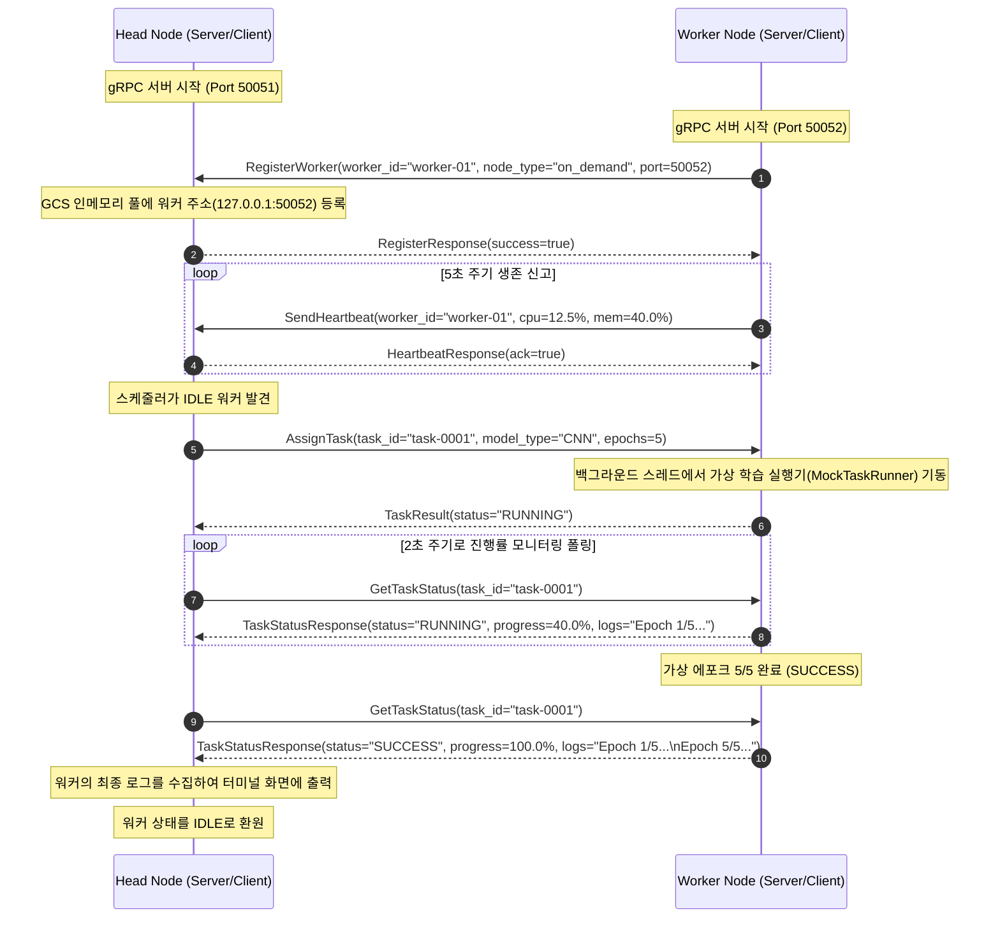

# 🛠️ Baby Ray: 양방향 gRPC API 및 기술 명세서

본 문서는 Docker 기반 경량 분산 런타임(Baby Ray) 프로젝트의 **1단계: 양방향 작업 할당 및 모니터링 통신 설계 명세서**입니다. Head 노드와 Worker 노드가 각각 서버와 클라이언트 역할을 유기적으로 분담하는 고속 비동기 제어 구조 및 API 메시지 규격을 상세히 기술합니다.

---

## 1. 양방향 gRPC 통신 아키텍처 개요

본 프로젝트에서는 단방향 폴링이나 단순 스트리밍 한계를 극복하고, 노드 간 명령을 능동적으로 주고받기 위해 **양방향 서버-클라이언트 아키텍처**를 채택했습니다.

```
┌──────────────────────────────────────┐                   ┌──────────────────────────────────────┐
│       Head Node (스케줄러/GCS)        │                   │             Worker Node              │
│  • gRPC 서버 (Port 50051)            │ ◄──────────────── │  • gRPC 클라이언트 (Heartbeat 송신)   │
│  • gRPC 클라이언트 (Task 배정 및 폴링)  │ ────────────────► │  • gRPC 서버 (Port 50052 등 개방)     │
└──────────────────────────────────────┘                   └──────────────────────────────────────┘
```

1. **상향 통신 (Worker ──► Head)**:
   - Worker가 기동되면 Head 서버(50051)로 자신을 **등록(RegisterWorker)**하고, 5초 주기로 CPU/Memory 사용량 등의 생존 신고 메트릭을 **전송(SendHeartbeat)**합니다.
2. **하향 통신 (Head ──► Worker)**:
   - Head의 백그라운드 스케줄러가 가용(IDLE) 워커를 탐색하여 작업을 비동기로 **배정(AssignTask)**하고, 2초 주기로 작업 진행률과 가상 학습 로그를 **조회(GetTaskStatus)**합니다.

---

## 2. Protobuf 정의 및 메시지 명세 ([babyray.proto](file:///c:/Users/win/Desktop/클라우드  WE-MEET 프로젝트/WE-MEET/proto/babyray.proto))

gRPC 인터페이스 및 직렬화 스펙 정의 파일의 메시지 필드 규격입니다.

### 서비스 정의 (`BabyRayService`)
```protobuf
syntax = "proto3";

package babyray;

service BabyRayService {
  // Worker -> Head: 가상 노드 생명주기 관리
  rpc RegisterWorker (RegisterRequest) returns (RegisterResponse);
  rpc DeregisterWorker (DeregisterRequest) returns (DeregisterResponse);

  // Worker -> Head: 생존 신고 및 자원 상태 리포트
  rpc SendHeartbeat (HeartbeatRequest) returns (HeartbeatResponse);

  // Head -> Worker: 비동기 작업 제어 및 모니터링
  rpc AssignTask (TaskAssignment) returns (TaskResult);
  rpc GetTaskStatus (TaskStatusRequest) returns (TaskStatusResponse);

  // Head -> Worker: 자원 격리 한도 조정
  rpc ResizeResources (ResizeRequest) returns (ResizeResponse);
}
```

---

### API 상세 메시지 규격

#### 1) RegisterWorker
Worker가 시작 시 Head 노드에 자신을 등록하여 통신 주소와 유형을 알립니다.
* **`RegisterRequest` (요청)**:
  - `worker_id` (string): 워커 고유 식별 식별자 (예: `"worker-01"`)
  - `node_type` (string): 노드 타입 (예: `"on_demand"`, `"spot_a"`)
  - `port` (int32): 워커 본인이 개방하여 명령을 대기 중인 gRPC 서버 포트 (예: `50052`)
* **`RegisterResponse` (응답)**:
  - `success` (bool): 등록 승인 성공 여부 (`true` / `false`)
  - `message` (string): 등록 처리 결과 관련 안내 문자열

#### 2) SendHeartbeat
Worker가 자신의 자원 실시간 메트릭 및 생존 여부를 주기적으로 Head에 전송합니다.
* **`HeartbeatRequest` (요청)**:
  - `worker_id` (string): 워커 식별 고유 ID
  - `cpu_utilization` (float): 실시간 CPU 사용률 (%)
  - `memory_utilization` (float): 실시간 메모리 사용률 (%)
* **`HeartbeatResponse` (응답)**:
  - `ack` (bool): 수신 승인 플래그 (`true`)

#### 3) AssignTask
Head가 가용한 Worker에게 비동기 가상 ML 모델 학습 작업을 위임합니다.
* **`TaskAssignment` (요청)**:
  - `task_id` (string): 스케줄러가 발급한 고유 작업 ID (예: `"task-0001"`)
  - `model_type` (string): 실행할 AI 연산 모델 종류 (`CNN`, `RNN`, `LSTM`)
  - `dataset_path` (string): 학습에 사용할 데이터셋 경로
  - `epochs` (int32): 수행할 가상 학습 에포크 수
* **`TaskResult` (응답)**:
  - `task_id` (string): 대상 작업 ID
  - `status` (string): 즉시 수락 상태 (`RUNNING`, `FAILED`)
  - `execution_time` (float): 초기 할당 시에는 `0.0` 반환
  - `message` (string): 작업 접수 관련 세부 텍스트

#### 4) GetTaskStatus
Head가 배정한 가상 작업의 진행 과정 및 에포크 로그 정보를 폴링(Polling) 조회합니다.
* **`TaskStatusRequest` (요청)**:
  - `task_id` (string): 모니터링 대상 가상 작업 ID
* **`TaskStatusResponse` (응답)**:
  - `status` (string): 현재 실행 상태 (`RUNNING`, `SUCCESS`, `FAILED`)
  - `progress` (float): 연산 진행률 백분율 (`0.0` ~ `100.0` %)
  - `logs` (string): 현재까지 누적된 가상 에포크별 로그 결과 데이터

---

## 3. 통신 시퀀스 다이어그램 (Sequence Diagram)



---

## 4. 포터블 로컬 검증 CLI 명령어

본 코드는 팀원 간 절대 경로 충돌이 일어나지 않도록 상대 경로 패치가 완료되어 있으며, 터미널 실행 또는 동봉된 배치 파일을 통해 즉시 작동 검증이 가능합니다.

### Windows (PowerShell) 구동 명령어
1. **Head 노드 실행 (터미널 1)**:
   ```powershell
   .\.venv\Scripts\python.exe head\head.py
   ```
2. **Worker 노드 실행 (터미널 2)**:
   ```powershell
   .\.venv\Scripts\python.exe worker\worker.py --id worker-01 --port 50052
   ```

### 배치파일을 이용한 원클릭 구동
- Head 실행: [run_head.bat](file:///c:/Users/win/Desktop/클라우드  WE-MEET 프로젝트/WE-MEET/run_head.bat) 실행
- Worker 실행: [run_worker.bat](file:///c:/Users/win/Desktop/클라우드  WE-MEET 프로젝트/WE-MEET/run_worker.bat) 실행
