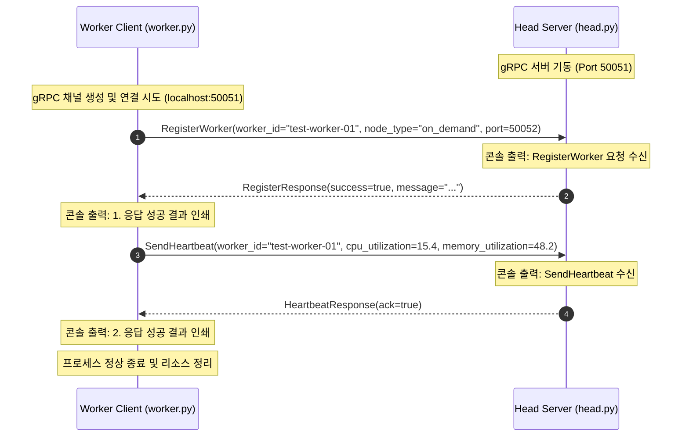

# 🔌 gRPC 연결 체크용 깡통(Skeleton) 코드 API 기술 명세서

본 문서는 **WE-MEET** 프로젝트의 가상 분산 클러스터 인프라 기동 전, Head 노드(Server)와 Worker 노드(Client) 간의 기초적인 네트워크 연동과 gRPC 통신이 정상 체결되는지 검증하기 위한 **초경량 연결 체크용 API 명세서**입니다.

---

## 1. 통신 아키텍처 개요

연결 체크 깡통 코드는 불필요한 스케줄러, 백그라운드 스레드, 데이터베이스(GCS) 연동 및 AI 모델 실행 로직을 전부 제외하고 오직 **동기식(Synchronous) 단방향 gRPC 메시지 핑퐁**만을 검증합니다.

```
┌─────────────────────────────────┐           gRPC (Port 50051)           ┌─────────────────────────────────┐
│          Worker Node            │ ────────────────────────────────────> │            Head Node            │
│   (gRPC Client: worker.py)      │ <──────────────────────────────────── │    (gRPC Server: head.py)       │
└─────────────────────────────────┘                                       └─────────────────────────────────┘
  1) RegisterWorker(ID, Type) ──►                                           ◀── RegisterResponse(success, msg)
  2) SendHeartbeat(ID, CPU, Mem) ──►                                        ◀── HeartbeatResponse(ack)
```

---

## 2. Protobuf 정의 및 메시지 규격

통신에 사용되는 인터페이스 정의 파일([babyray.proto](file:///c:/Users/win/Desktop/클라우드  WE-MEET 프로젝트/WE-MEET/proto/babyray.proto)) 내에서 이번 실험에 쓰이는 핵심 API와 데이터 메시지 구조는 다음과 같습니다.

### 가. gRPC 서비스 인터페이스
```protobuf
syntax = "proto3";

package babyray;

service BabyRayService {
  // Worker -> Head: Worker 연결 등록 요청
  rpc RegisterWorker (RegisterRequest) returns (RegisterResponse);

  // Worker -> Head: 주기적 생존 신고 및 자원 정보 전송
  rpc SendHeartbeat (HeartbeatRequest) returns (HeartbeatResponse);
}
```

### 나. 메시지 상세 규격

#### 1) RegisterWorker (워커 연결 등록)
* **요청 메시지 (`RegisterRequest`)**
  | 필드 번호 | 필드명 | 타입 | 설명 | 예시 |
  | :--- | :--- | :--- | :--- | :--- |
  | 1 | `worker_id` | `string` | 워커 식별 고유 ID | `"test-worker-01"` |
  | 2 | `node_type` | `string` | 노드 형태 (on_demand, spot 등) | `"on_demand"` |
  | 3 | `port` | `int32` | 워커의 자체 개방 포트 | `50052` |

* **응답 메시지 (`RegisterResponse`)**
  | 필드 번호 | 필드명 | 타입 | 설명 | 예시 |
  | :--- | :--- | :--- | :--- | :--- |
  | 1 | `success` | `bool` | 등록 승인 성공 여부 | `true` |
  | 2 | `message` | `string` | 서버 응답 안내 메시지 | `"[Head] 연결 성공! Worker 등록이 접수되었습니다."` |

---

#### 2) SendHeartbeat (생존 신고 및 메트릭 전송)
* **요청 메시지 (`HeartbeatRequest`)**
  | 필드 번호 | 필드명 | 타입 | 설명 | 예시 |
  | :--- | :--- | :--- | :--- | :--- |
  | 1 | `worker_id` | `string` | 워커 식별 고유 ID | `"test-worker-01"` |
  | 2 | `cpu_utilization` | `float` | 워커 호스트의 CPU 사용률 (%) | `15.4` |
  | 3 | `memory_utilization` | `float` | 워커 호스트의 메모리 사용률 (%) | `48.2` |

* **응답 메시지 (`HeartbeatResponse`)**
  | 필드 번호 | 필드명 | 타입 | 설명 | 예시 |
  | :--- | :--- | :--- | :--- | :--- |
  | 1 | `ack` | `bool` | 수신 확인 응답 값 | `true` |

---

## 3. 통신 시퀀스 다이어그램 (Sequence Diagram)



---

## 4. 로컬 환경 검증 및 실행 절차

이 깡통 코드는 환경 변수나 복잡한 의존성 없이 로컬 가상 환경 내에서 다음 절차를 통해 가볍게 1분 내로 실험할 수 있습니다.

### 1단계: Head 서버 구동
프로젝트 루트 디렉토리에서 첫 번째 터미널을 열고 서버를 실행합니다.
```bash
python head/head.py
```
* **출력 기대치:**
  ```text
  === [Head Server] 50051 포트에서 gRPC 서버 시작 완료 ===
  ```

### 2단계: Worker 클라이언트 연결 테스트 수행
두 번째 터미널을 열고 연결 테스트를 실행합니다.
```bash
python worker/worker.py
```
* **출력 기대치 (Worker):**
  ```text
  [Worker Client] Head 노드 연결 중: localhost:50051...
  [Worker Client] 1. RegisterWorker 요청 송신...
  [Worker Client] 1. 응답 성공! 결과: success=True, message='[Head] 연결 성공! Worker 등록이 접수되었습니다.'
  [Worker Client] 2. SendHeartbeat 요청 송신...
  [Worker Client] 2. 응답 성공! 결과: ack=True

  === [Worker Client] gRPC 연결 체크 실험 성공! ===
  ```
* **출력 기대치 (Head):**
  ```text
  [Head Server] RegisterWorker 요청 수신 | ID: 'test-worker-01', Type: 'on_demand'
  [Head Server] SendHeartbeat 수신 | ID: 'test-worker-01', CPU: 15.4%, Mem: 48.2%
  ```
