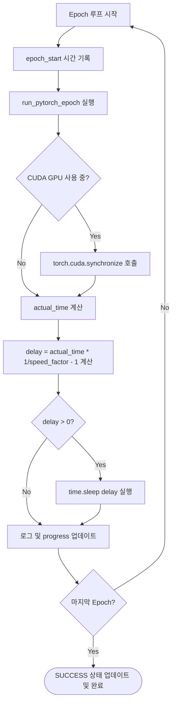

# Worker GPU Simulator 기술 명세서: 이종 GPU 성능 모사 엔진 및 3대 ML 워크로드

이 문서는 Baby Ray 분산 시스템 환경에서 고가의 다중 물리 GPU 클러스터 없이도 로컬 환경에서 비대칭적 자원 및 이기종 성능을 실증하기 위해 구축된 **이종 GPU 성능 시뮬레이터(GPU Simulator)**의 지연 산출 알고리즘, 지원 딥러닝 모델 아키텍처 및 내부 구현 규격을 정의합니다.

---

## 1. 개요 및 시뮬레이션 목적

로컬 개발 환경(단일 GPU 탑재 기기)에서 성능 등급과 요금제가 다른 여러 유형의 가상 인스턴스(On-Demand, Spot-A, Spot-B)들을 동시에 띄워 연산을 돌릴 때, 실제 하드웨어 편차가 있는 것처럼 동작 속도를 제어하는 시뮬레이터 모듈입니다.
이 모듈을 통해 동적 스케줄링 알고리즘 및 자원 분배 최적화 정책이 정상 작동하는지를 정량적으로 검증할 수 있습니다.

---

## 2. 시뮬레이션 알고리즘 및 지연 계산 모델

물리적인 연산 속도 제어는 PyTorch의 비동기 CUDA 커널 처리를 강제 제어하는 **동기화 명령어**와 **지연 시간 산출 수식**을 통해 이루어집니다.

### 가. 수학적 지연 계산 공식
1. **실제 물리 연산 시간 ($T_{\text{actual}}$) 측정**:
   에포크 시작 시각과 종료 시각을 기록하여 순수 물리적 연산에 소요된 시간 측정
2. **목표 가상 시간 ($T_{\text{target}}$) 도출**:
   속도 성능 계수($F_{\text{speed}}$)를 나눈 목표 수행 시간을 계산
   $$T_{\text{target}} = \frac{T_{\text{actual}}}{F_{\text{speed}}}$$
3. **추가 수면 지연 시간 ($D_{\text{delay}}$) 계산**:
   목표 시간과 물리 시간의 편차를 구하여 스레드 대기 시간으로 적용
   $$D_{\text{delay}} = T_{\text{target}} - T_{\text{actual}} = T_{\text{actual}} \times \left( \frac{1}{F_{\text{speed}}} - 1 \right)$$
   *(단, $D_{\text{delay}} > 0$ 조건일 때만 실재 `time.sleep(D_{\text{delay}})` 호출)*

### 나. 노드 등급별 속도 배율 및 연산 모사 수치 분석
아래 표는 1 에포크의 물리 연산 시간이 각각 $2.0$초, $3.0$초, $4.0$초 소요될 때의 성능 시뮬레이션 결과입니다.

| 노드 유형 (Type) | 성능 계수 ($F_{\text{speed}}$) | 가상 요금 ($ / hr) | CNN (Base 2.0s) | RNN (Base 3.0s) | LSTM (Base 4.0s) |
| :--- | :--- | :--- | :--- | :--- | :--- |
| **On-Demand** | **$1.0$** (지연 없음) | $1.0 | $T_{\text{target}} = 2.0$s<br>($D_{\text{delay}} = 0.0$s) | $T_{\text{target}} = 3.0$s<br>($D_{\text{delay}} = 0.0$s) | $T_{\text{target}} = 4.0$s<br>($D_{\text{delay}} = 0.0$s) |
| **Spot-A** | **$0.6$** (60% 성능) | $0.4 | $T_{\text{target}} = 3.3$s<br>($D_{\text{delay}} = 1.3$s) | $T_{\text{target}} = 5.0$s<br>($D_{\text{delay}} = 2.0$s) | $T_{\text{target}} = 6.7$s<br>($D_{\text{delay}} = 2.7$s) |
| **Spot-B** | **$0.3$** (30% 성능) | $0.2 | $T_{\text{target}} = 6.7$s<br>($D_{\text{delay}} = 4.7$s) | $T_{\text{target}} = 10.0$s<br>($D_{\text{delay}} = 7.0$s) | $T_{\text{target}} = 13.3$s<br>($D_{\text{delay}} = 9.3$s) |

---

## 3. 에포크 단위 실행 흐름 및 동기화 기법

학습 에포크가 진행되는 동안 시뮬레이터 객체(`PyTorchTaskRunner`) 내부에서 처리되는 흐름은 다음과 같습니다.



- **CUDA 동기화의 필수성 (`torch.cuda.synchronize()`)**: 
  PyTorch의 GPU 연산(CUDA 커널 실행)은 비동기(Asynchronous) 방식으로 처리됩니다. 즉, Python 단에서 코드 실행이 완료되어 다음 라인으로 넘어가더라도, GPU 하드웨어 내부에서는 여전히 이전 연산이 돌고 있습니다.
  따라서 `torch.cuda.synchronize()`를 명시적으로 호출해 GPU 연산이 완전히 완료될 때까지 CPU를 블로킹한 뒤 시각을 측정해야만 왜곡 없는 정확한 물리 연산 시간($T_{\text{actual}}$)을 얻을 수 있습니다.

---

## 4. 3대 ML 워크로드 신경망 구조 및 연산 사양

시뮬레이터 내부에서 실제 텐서 연산을 통해 물리 부하를 생성하는 PyTorch 모델 구조입니다.
모든 하이퍼파라미터는 `gpu_simulator.py` 상단의 설정 상수로 분리되어 외부 조정이 용이합니다.

### ① 이미지 분류 (CNNModel) — 3-Layer Conv + BatchNorm + Dropout
- **네트워크 구성**:
  `Conv2d(1→32) + BN + ReLU + MaxPool` $\rightarrow$ `Conv2d(32→64) + BN + ReLU + MaxPool` $\rightarrow$ `Conv2d(64→128) + BN + ReLU + MaxPool` $\rightarrow$ `Dropout(0.3)` $\rightarrow$ `FC(1152→128) + ReLU` $\rightarrow$ `FC(128→10)`
- **데이터 구조**: 합성 MNIST 이미지 형태의 4차원 텐서 `(Batch=128, Channel=1, Width=28, Height=28)`
- **에포크당 연산**: 미니배치 100회 반복 (총 12,800장/에포크)
- **연산 패턴**: 3단계 공간 필터링 + BatchNorm 통계 추적으로 GPU 연산 집약형 부하 극대화

### ② 시계열 예측 (RNNModel) — 2-Layer Stacked RNN + Dropout
- **네트워크 구성**: `nn.RNN(input_size=32, hidden_size=64, num_layers=2, dropout=0.3)` $\rightarrow$ `nn.Linear(64, 10)`
- **데이터 구조**: 3차원 시퀀스 텐서 `(Batch=128, SeqLen=30, Feature=32)`
- **에포크당 연산**: 미니배치 100회 반복
- **연산 패턴**: 2층 스택 순환 구조로 시차 의존 연산량 증대, CPU/GPU 균형 연산형

### ③ 자연어 처리 (LSTMModel) — 2-Layer Stacked LSTM + Embedding
- **네트워크 구성**: `nn.Embedding(vocab=1000, dim=32)` $\rightarrow$ `nn.LSTM(input_size=32, hidden_size=64, num_layers=2, dropout=0.3)` $\rightarrow$ `nn.Linear(64, 10)`
- **데이터 구조**: 정수 인덱스 시퀀스 `(Batch=128, SeqLen=30)` → Embedding → `(Batch=128, SeqLen=30, Dim=32)`
- **에포크당 연산**: 미니배치 100회 반복
- **연산 패턴**: Embedding 룩업 + 4-게이트 LSTM 2층 스택으로 메모리 집약형 부하 극대화

### 부하 제어 하이퍼파라미터 요약

| 파라미터 | 이전 값 | 변경 값 | 효과 |
| :--- | :--- | :--- | :--- |
| 배치 크기 | 64 | **128** | GPU 메모리 점유 2배 증가 |
| 미니배치 반복 | 50 | **100** | 에포크당 연산량 2배 증가 |
| RNN/LSTM 시퀀스 길이 | 15 | **30** | 순환 연산 깊이 2배 |
| RNN/LSTM 피처 크기 | 10 | **32** | 은닉 계산 복잡도 증가 |
| RNN/LSTM 은닉 차원 | 20 | **64** | 파라미터 수 대폭 증가 |
| CNN 채널 수 | 16 (1층) | **32→64→128 (3층)** | 합성곱 연산량 대폭 증가 |
| Fallback 더미 루프 | 200,000 | **500,000** | PyTorch 없이도 CPU 부하 증가 |

---

## 5. 의존성 Fallback 예외 안전 처리

로컬 실행 환경에 CUDA 디바이스 드라이버가 없거나, PyTorch 라이브러리가 아예 설치되어 있지 않은 환경에서도 프로그램이 비정상 종료되지 않도록 하는 다중 계층 예외 보호막입니다.

```python
try:
    import torch
    HAS_TORCH = True
except ImportError:
    HAS_TORCH = False
```

- **라이브러리 부재 시 대체 연산**: 
  `HAS_TORCH = False`인 상태가 되면, 에포크 당 실제 학습 연산 대신 CPU 부하를 모사하기 위해 약 50만 회의 더미 연산 루프(`for x in range(500000)`) 및 50ms의 강제 대기(`time.sleep(0.05)`)를 실행합니다.
- **예외 복구 메커니즘**:
  PyTorch가 있더라도 연산 도중 에러가 나면 예외 캐치(`except Exception`)를 통해 `loss = 1.0 / (epoch + 1)` 값으로 자동 대체하고 학습 루프를 무사히 끝마치도록 보장합니다.
- **속도 시뮬레이션 호환**: 
  Fallback 모드에서도 측정된 물리적 수행 시간을 기준으로 `speed_factor`에 맞춘 `delay` 계산과 sleep 처리가 고스란히 유효하게 동작합니다.
