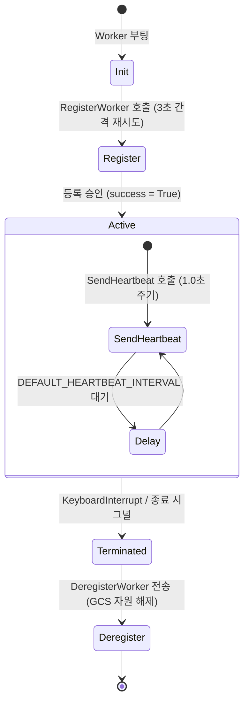

# Worker Node 기술 명세서: gRPC 통신 서버 및 하트비트 송신 메커니즘

이 문서는 Baby Ray 분산 컴퓨팅 시스템의 작업 수행 주체인 **Worker Node**의 아키텍처, gRPC 서비스 서버 사양, 그리고 Head Node와의 통신 프로토콜을 정의한 기술 명세서입니다.

---

## 1. 개요 및 역할

Worker Node는 Head Node의 제어 명령을 수신하여 실제 머신러닝 연산(PyTorch 또는 Fallback 더미 연산)을 백그라운드 스레드에서 구동하고, 자신의 상태 및 자원 사용량 메트릭을 주기적으로 Head Node에 보고하는 역할을 담당합니다.

```
┌────────────────────────────────────────────────────────┐
│                      Worker Node                       │
│  ┌───────────────────────┐    ┌─────────────────────┐  │
│  │     gRPC 서비스 서버  │    │   하트비트 송신기   │  │
│  │    (worker_server)    │    │ (heartbeat_sender)  │  │
│  └───────────────────────┘    └─────────────────────┘  │
│              ▲                           │             │
│              │ (AssignTask)              │ (Send       │
│              │                           │  Heartbeat) │
│              ▼                           ▼             │
│   ┌─────────────────────┐                               │
│   │  PyTorchTaskRunner  │                               │
│   │ (gpu_simulator.py)  │                               │
│   └─────────────────────┘                               │
└────────────────────────────────────────────────────────┘
```

---

## 2. 주요 구성 컴포넌트

Worker Node는 구동 시 메인 스레드와 백그라운드 스레드가 결합하여 독립적인 두 영역의 통신 채널을 가집니다.

1. **gRPC 서비스 수신 서버 (Server)**: Head Node가 전달하는 작업 지시(`AssignTask`) 및 모니터링 폴링(`GetTaskStatus`) 요청을 수신 및 처리합니다.
2. **하트비트 송신 클라이언트 (Client)**: 1.0초 주기로 자신의 자원 메트릭과 상태를 헤드 노드의 GCS에 지속해서 신고합니다.

---

## 3. Worker Node gRPC 서비스 핸들러 명세

Worker Node는 내부적으로 `BabyRayServiceServicer` 프로토콜을 상속받아 서버 측 기능을 처리합니다.

### ① `AssignTask(self, request, context)`
- **역할**: 신규 머신러닝 연산 요청을 접수받아 유효성을 검사한 뒤 백그라운드 스레드에서 시뮬레이터를 가동합니다.
- **매개변수 (`request`)**: `TaskAssignment` 프로토콜 버퍼 메시지
- **응답 (`TaskResult`)**:
  - `task_id` (str): 작업 고유 ID
  - `status` (str): 즉시 반환될 승인 상태 (`RUNNING` 또는 `FAILED`)
  - `execution_time` (float): 초기 리턴값 `0.0`
  - `message` (str): 접수 처리 세부 정보
- **상세 동작**:
  - `threading.Lock`을 활용한 동시성 락을 획득합니다.
  - 현재 워커에서 실행 중인 태스크가 존재하는지 체크합니다 (`self.current_task_id is not None` 및 `self.runner.status == "RUNNING"` 조건 검사).
  - 이미 연산이 활성화된 상태라면 중복 할당 거절 메시지와 함께 `FAILED` 상태를 즉시 반환하여 작업 간섭을 원천 방지합니다.
  - 신규 작업인 경우 `PyTorchTaskRunner` 인스턴스를 바인딩하고, 메인 gRPC 스레드가 대기(Block)하지 않도록 별도의 비동기 데몬 스레드를 분기하여 실행합니다.

### ② `GetTaskStatus(self, request, context)`
- **역할**: 실행 중인 학습 작업의 상태, 진행 백분율, 누적 로그를 Head Node의 모니터링 요청에 맞추어 즉시 회신합니다.
- **매개변수 (`request`)**: `TaskStatusRequest` (대상 `task_id`)
- **응답 (`TaskStatusResponse`)**:
  - `status` (str): 실행기 내부 상태 (`RUNNING`, `SUCCESS`, `FAILED`, `NOT_FOUND`)
  - `progress` (float): 학습 진행 백분율 (0.0% ~ 100.0%)
  - `logs` (str): 각 Epoch 마다 누적되어 저장된 로깅 문자열
- **상세 동작**:
  - 요청된 `task_id`가 현재 바인딩된 `self.runner.task_id`와 다를 경우 상태를 `"NOT_FOUND"`로 회신합니다.
  - 일치할 경우 실행기 객체에서 실시간 수집된 로그(`\n` 구분자로 병합) 및 진행 지표를 전달합니다.

### ③ `ResizeResources(self, request, context)`
- **역할**: 컨테이너의 하드웨어 할당 제어 명령에 맞추어 내부 환경 설정을 변경하기 위한 가상 API입니다.
- **매개변수 (`request`)**: `ResizeRequest` (목표 CPU 코어, Memory 바이트)
- **응답 (`ResizeResponse`)**: 성공 여부 메시지

---

## 4. 하트비트 생존 신고 및 상태 리포트 메커니즘

워커가 기동되면 `heartbeat_sender_loop` 함수가 독립된 데몬 스레드로 즉시 실행되어 아래 단계를 순차적으로 밟아 나갑니다.

### 가. 워커 라이프사이클 흐름 (State Machine)


### 나. 세부 동작 구조
1. **서버 예비 부팅 대기**: 자체 gRPC 서비스 서버가 포트 바인딩 및 부팅이 완전히 끝날 수 있도록 1.0초간 지연(`time.sleep(1.0)`) 후 동작을 실행합니다.
2. **Head Node 자동 등록 (Register)**:
   - Head Node의 IP 및 포트로 채널을 열어 `RegisterWorker` 원격 호출을 전송합니다.
   - 연결 거부나 통신 지연(`RpcError`) 발생 시 무한 루프 내에서 **3.0초** 간격으로 계속해서 등록 요청을 재시도하여 노드 기동 순서에 따른 장애를 방지합니다.
3. **주기적 생존 보고 및 자원 계측 (Heartbeat)**:
   - 등록 완료 시, `DEFAULT_HEARTBEAT_INTERVAL` (기본값: 1.0초) 주기로 루프를 수행합니다.
   - `SendHeartbeat` 원격 호출을 통해 워커 식별자, 실시간 CPU 사용률 메트릭 및 메모리 점유 메트릭 정보를 전송합니다.
   - 전송 중 예외가 감지되면 콘솔에 경고 로그를 출력하되 스레드를 중단하지 않고 대기 후 다음 주기에 전송을 지속 재시도합니다.
4. **우아한 종료 (Graceful Shutdown)**:
   - 워커 노드 기동 스크립트에 `KeyboardInterrupt` 시그널이 도달하면 소멸 소환 루프가 동작합니다.
   - Head Node로 `DeregisterWorker` 요청을 전달하여 마스터 노드의 레지스트리(GCS)에서 자신을 안전하게 파기하고 메모리를 회수하게 한 후 gRPC 서버를 완전히 종료합니다.


## gRPC IP 및 Port 처리 방식 분석 (head.py 기준)

## 5. Head Node의 gRPC IP 및 Port 처리 메커니즘

제공된 `head.py` 코드에서 Head 노드가 자신을 호스팅하고, 통신을 요청한 Worker 노드의 IP와 Port를 식별하여 역방향 통신(Task 할당)을 수행하는 과정은 다음과 같이 구현되어 있다.

### 가. Head 서버의 수신 대기 (Port Binding)

Head 노드가 gRPC 서버를 구동할 때, 외부의 연결을 받아들이기 위해 네트워크 인터페이스와 포트를 바인딩하는 로직이다.

```python
port = os.environ.get("HEAD_PORT", str(DEFAULT_HEAD_PORT))
server.add_insecure_port(f"[::]:{port}")

```

* **동적 포트 할당:** 환경변수 `HEAD_PORT`를 최우선으로 확인하며, 없을 경우 `config.py`에 정의된 `DEFAULT_HEAD_PORT`(예: 50051)를 기본값으로 사용한다.
* **`[::]` 바인딩:** IPv4의 `0.0.0.0`과 동일한 역할을 하는 IPv6 와일드카드 주소다. 즉, 로컬호스트(`127.0.0.1`) 뿐만 아니라, 외부망(공인 IP)이나 도커 브릿지 네트워크 등 머신에 할당된 모든 네트워크 인터페이스의 요청을 해당 포트에서 수신하겠다는 의미다.

### 나. 접속한 Worker의 IP 식별 및 파싱 (Peer Extraction)

Worker가 `RegisterWorker` API를 호출할 때, Head 서버는 gRPC 컨텍스트(`context.peer()`)를 통해 접근한 클라이언트의 실제 IP 주소를 역추적하여 추출한다.

```python
peer = context.peer()
if peer.startswith("ipv4:"):
    ip = peer.split(":")[1]
elif peer.startswith("ipv6:"):
    last_colon = peer.rfind(":")
    ip = peer[5:last_colon]
    ip = ip.replace("%5B", "").replace("%5D", "").replace("[", "").replace("]", "")
else:
    ip = "127.0.0.1"

if ip == "::1":
    ip = "127.0.0.1"

```

* **`context.peer()`:** gRPC 연결의 하위 계층(TCP) 소켓 정보를 문자열 형태로 반환한다. (예: `ipv4:192.168.0.10:54321`)
* **IPv4/IPv6 분기 처리:** * IPv4의 경우 `:`를 기준으로 분리하여 IP 부분만 추출한다.
* IPv6의 경우 대괄호(`[]`)나 URL 인코딩(`%5B`) 등의 포맷팅이 섞여 들어올 수 있으므로, 마지막 `:`(포트 구분자) 이전까지의 문자열을 슬라이싱한 후 불필요한 특수문자를 정제한다.


* **로컬호스트 정규화:** IPv6의 로컬 루프백 주소인 `::1`을 IPv4 형태인 `127.0.0.1`로 통일하여 GCS(`worker_registry`)에 일관된 포맷으로 저장한다.
* **Port 저장:** IP는 네트워크 소켓에서 추출하지만, Worker가 통신을 수신할 자신의 자체 gRPC 서버 포트는 Request 페이로드(`request.port`)를 통해 명시적으로 전달받아 함께 저장한다.

### 다. 역방향 통신 채널 수립 (Head -> Worker)

Q-Learning 스케줄러가 특정 Worker에게 작업을 할당(`AssignTask`)할 때, GCS 레지스트리에 저장해 둔 IP와 Port를 조합하여 타겟 주소를 생성한다.

```python
ip = worker_info['ip']
# IPv6 주소일 경우 대괄호 표기법 적용, IPv4는 일반 콜론 표기법 적용
worker_address = f"[{ip}]:{worker_info['port']}" if ":" in ip else f"{ip}:{worker_info['port']}"

channel = grpc.insecure_channel(worker_address)
stub = babyray_pb2_grpc.BabyRayServiceStub(channel)

```

* **포맷팅 규격 준수:** gRPC 채널 생성 시 주소 문자열 규칙을 따른다. 추출된 IP 내부에 `:`가 존재한다면 IPv6 주소로 간주하고 `[IP]:PORT` 형태로 조립하며, IPv4의 경우 `IP:PORT` 형태로 조립하여 채널(`insecure_channel`)을 성공적으로 오픈한다.